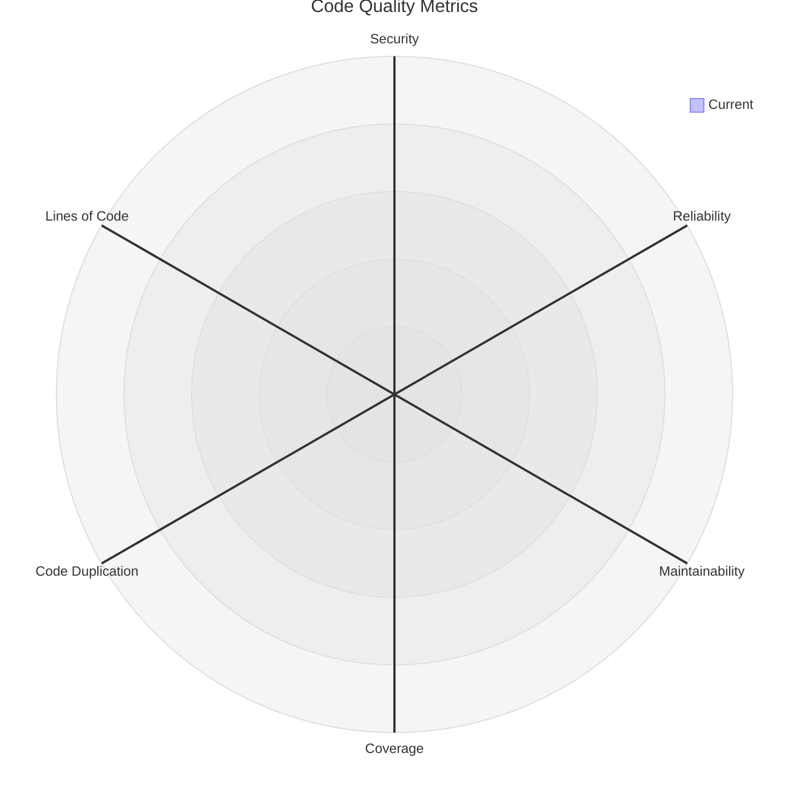

# Code Quality Report

## Quality Metrics Radar

## Current Metrics

| Metric | Current Value | Rating |
|--------|---------------|--------|
| Security Rating | No data | ❓ |
| Reliability Rating | No data | ❓ |
| Maintainability Rating | No data | ❓ |
| Coverage | No data | ❓ |
| Code Duplication | No data | ❓ |
| Lines of Code | No data | 📊 |

## SonarCloud Badges

Generated on: 2025-10-03T06:44:00.000Z

_This report will be automatically updated by the SonarCloud Quality Radar workflow on every push to main and pull requests._
