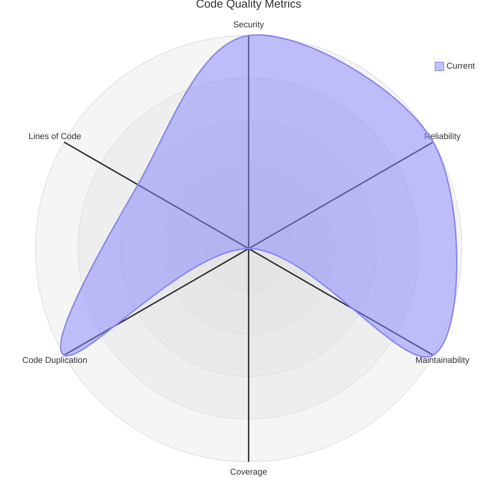

# Code Quality Report
## Quality Metrics Radar

## Current Metrics
| Metric | Current Value | Rating |
|--------|---------------|--------|
| Security Rating | 1.0 | 🟩 |
| Reliability Rating | 1.0 | 🟩 |
| Maintainability Rating | 1.0 | 🟩 |
| Coverage | 0.0% | ❌ |
| Code Duplication | 0.0% | 🟩 |
| Lines of Code | 934 | 📊 |
## SonarCloud Badges

Generated on: 2025-09-26T09:51:13.120Z