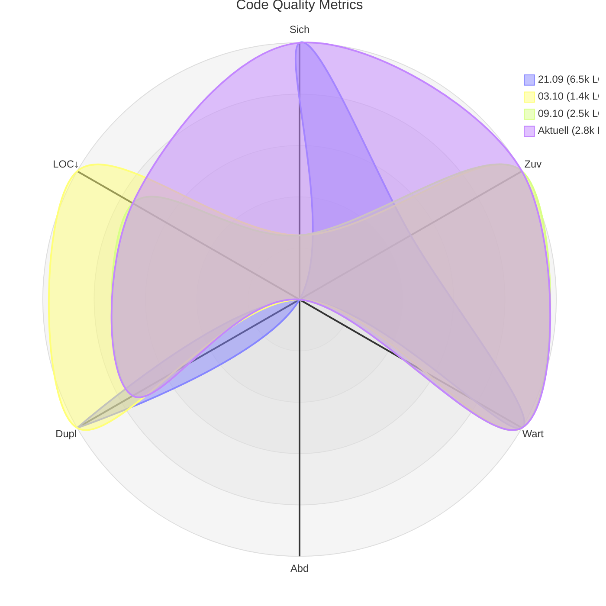

# Code Quality Report

## Quality Metrics Radar

## Current Metrics

| Metrik | Aktueller Wert | Bewertung |
|--------|----------------|-----------|
| Security Rating | 1.0 | 🟩 |
| Reliability Rating | 1.0 | 🟩 |
| Maintainability Rating | 1.0 | 🟩 |
| Coverage | 18.6% | 🟥 |
| Code Duplication | 12.8% | 🟩 |
| Lines of Code | 2766 | 🟩 |

## SonarCloud Badges

Generated on: 2025-10-17T13:46:00.864Z

> Fenster: offset=1, count=3. LOC relativ: min=1445 → 5, max=6470 → 1. Labels: dd.mm (deutsch) + kurze LOC (k).