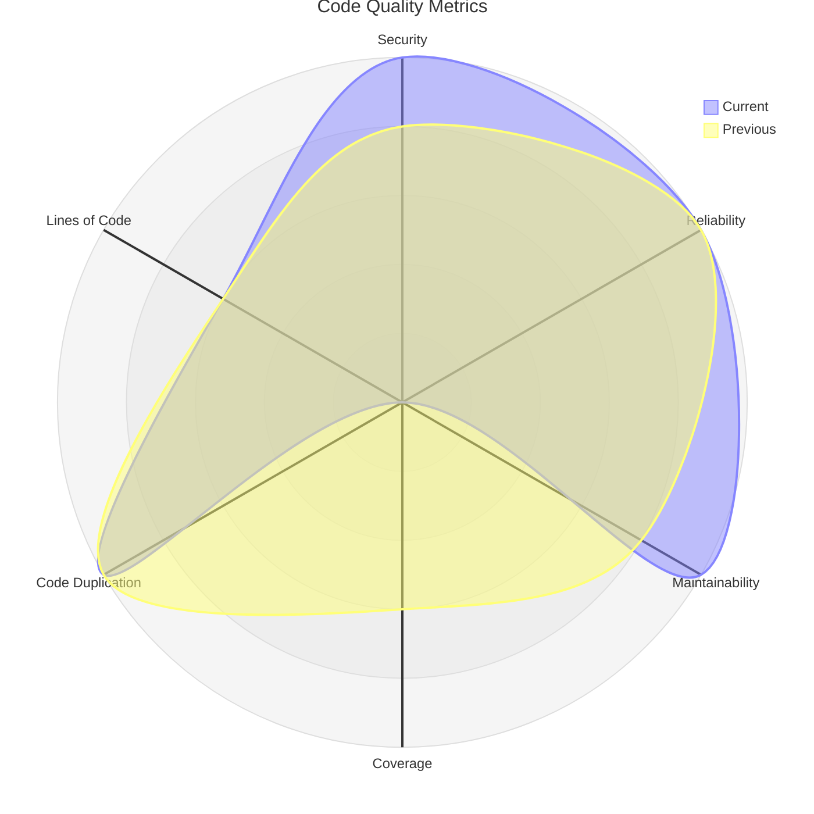

# SonarCloud Integration

This repository includes automated code quality analysis using SonarCloud through GitHub Actions.

## Features

- **Automatic Quality Analysis**: Runs on every pull request and push to main branch
- **Smart Triggering**: Skips analysis for PRs labeled with "chore"
- **Comprehensive Metrics**: Tracks security, reliability, maintainability, coverage, and code duplication
- **Visual Reports**: Generates radar charts showing quality metrics over time
- **Quality Badges**: Displays live SonarCloud badges in reports
- **PR Integration**: Comments on pull requests with quality reports

## Quality Report

The latest code quality analysis is available in [`codequality/report.md`](codequality/report.md).

## Configuration

- **SonarCloud Project**: `merlinbecker_CodexMiroir`
- **Organization**: `merlinbecker`
- **Token**: Stored in GitHub Secrets as `SONAR_TOKEN`

## Workflow

The quality analysis workflow:

1. Checks if PR has "chore" label (skips if present)
2. Builds the application with `npm run build`
3. Runs SonarCloud analysis
4. Fetches current and previous metrics
5. Generates radar chart with quality metrics
6. Updates the quality report
7. Comments on PRs with analysis results

## Metrics Tracked

- **Security Rating** (A-E scale)
- **Reliability Rating** (A-E scale)
- **Maintainability Rating** (A-E scale)
- **Test Coverage** (percentage)
- **Code Duplication** (percentage)
- **Lines of Code** (total count)

## Radar Chart

The radar chart visualizes quality metrics on a 0-5 scale:
- 5: Excellent (A rating or >80% coverage)
- 4: Good (B rating or >60% coverage)
- 3: Average (C rating or >40% coverage)
- 2: Below Average (D rating or >20% coverage)
- 1: Poor (E rating or <20% coverage)
- 0: No data available

### Comparison View

The radar chart displays **two curves** when previous analysis data is available:
- **Current** (blue curve): Latest metrics from the current analysis
- **Previous** (red curve): Metrics from the previous analysis run

This allows you to:
- Track quality trends over time
- See improvements or regressions at a glance
- Compare code quality before and after changes

Example radar chart with comparison:

In this example, you can see:
- Security improved from 4 to 5 (better)
- Maintainability improved from 4 to 5 (better)
- Coverage decreased from 3 to 0 (needs attention)
- Other metrics remained stable