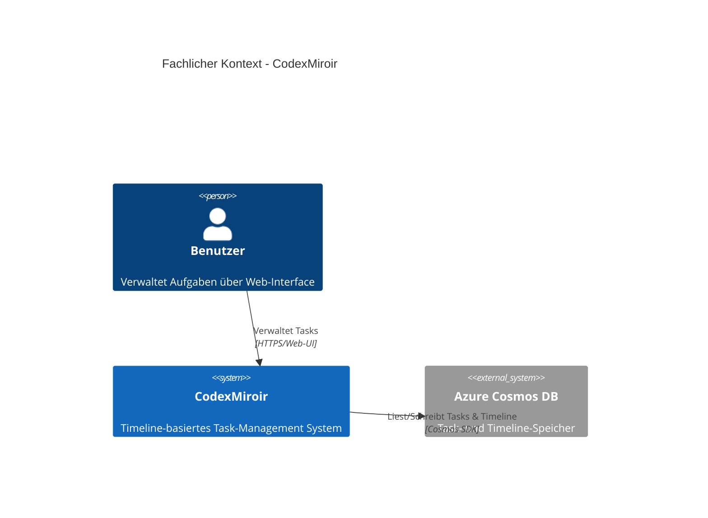
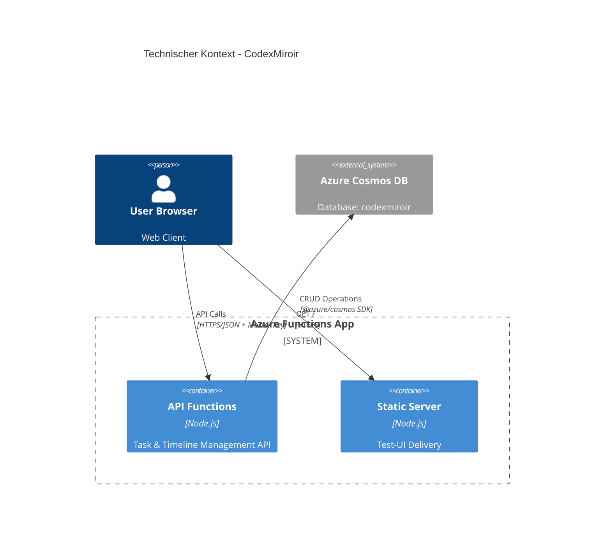
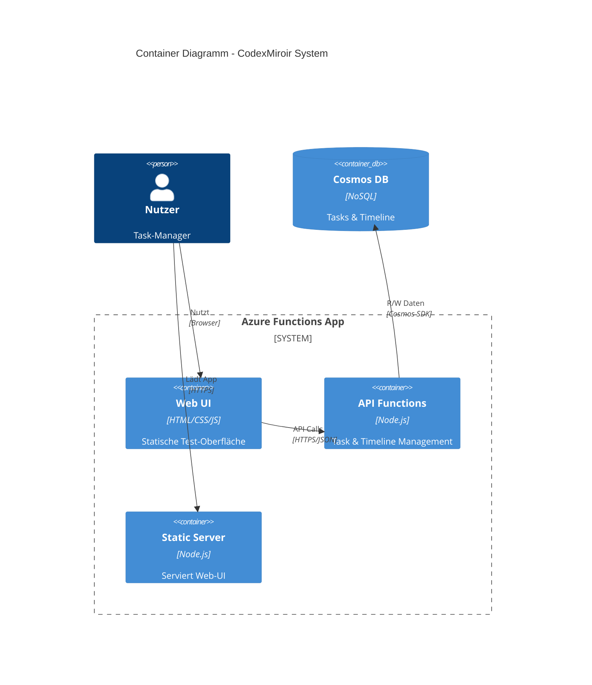
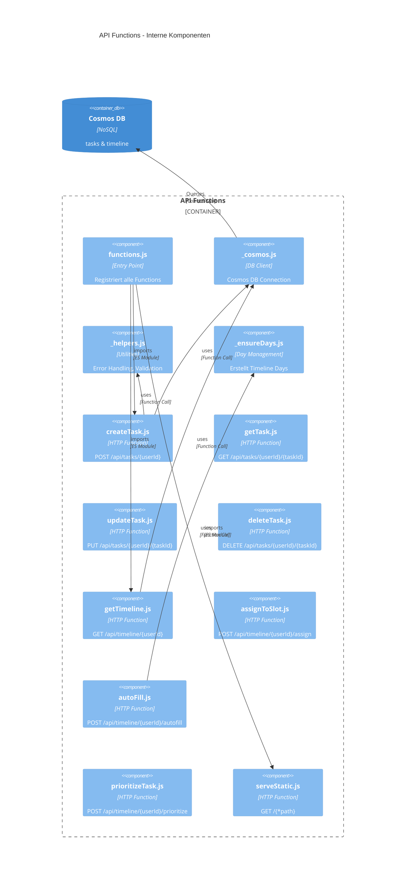
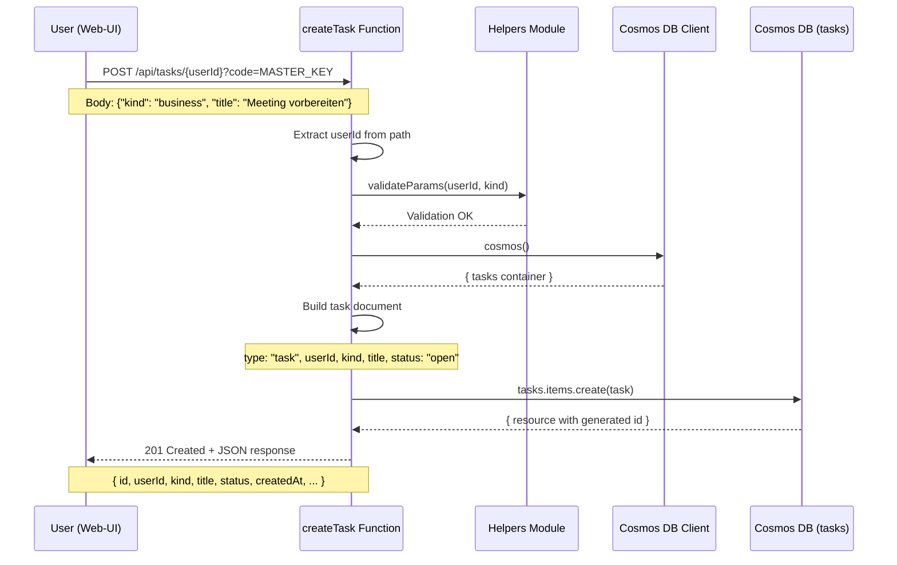
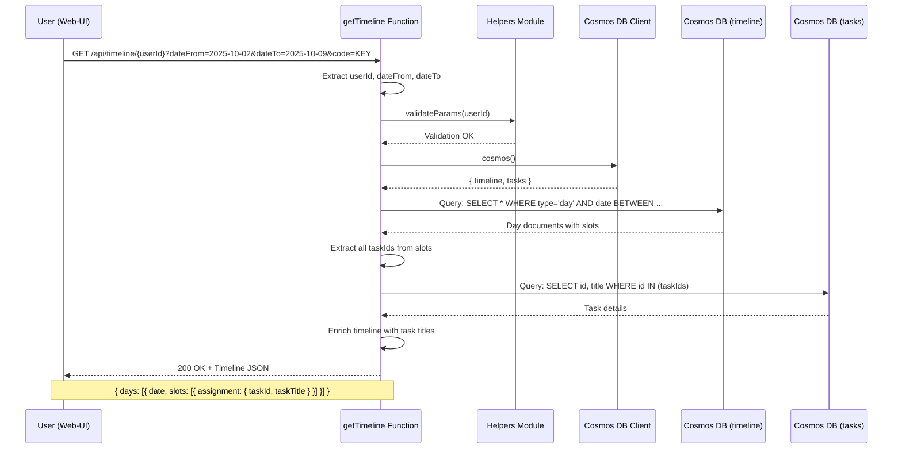
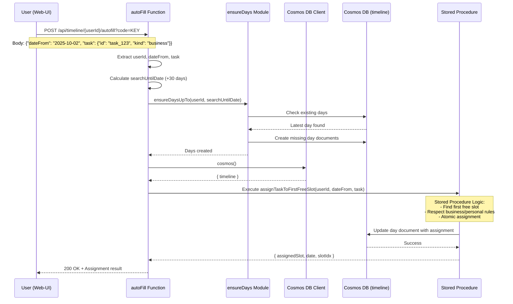

# CodexMiroir - Architektur Dokumentation

**Über arc42**

arc42, das Template zur Dokumentation von Software- und
Systemarchitekturen.

Template Version 8.2 DE. (basiert auf AsciiDoc Version), Januar 2023

Created, maintained and © by Dr. Peter Hruschka, Dr. Gernot Starke and
contributors. Siehe <https://arc42.org>.

# Einführung und Ziele

## Aufgabenstellung

CodexMiroir ist ein intelligentes Task-Management-System mit Timeline-basierter Aufgabenverwaltung. Das System implementiert eine **strukturierte Zeitslot-Verwaltung** mit automatischer und manueller Planung.

### Kernprinzipien:
- **Timeline-basierte Verwaltung**: Aufgaben werden in Zeitslots (Vormittag/Nachmittag/Abend) geplant
- **Zwei Aufgabenarten**: Business und Personal mit unterschiedlichen Planungsregeln
- **Zeitslots**: Tagesstruktur mit drei Slots (AM/PM/EV)
- **Multi-User-Support**: Jeder Benutzer hat eigene Timeline und Tasks
- **Cosmos DB**: Persistierung in Azure Cosmos DB mit Stored Procedures

### Funktionale Anforderungen:
- Task-Management (CRUD-Operationen: Create, Read, Update, Delete)
- Timeline-Verwaltung (Abrufen, Filtern nach Datum)
- Automatische Task-Planung (AutoFill mit Regelwerk)
- Manuelle Task-Zuweisung zu spezifischen Slots
- Task-Priorisierung (Tausch mit höchstpriorisiertem Task)
- Web-basierte Test-UI für Verwaltung
- User-ID-basierte Datentrennung

## Qualitätsziele

| Priorität | Qualitätsziel | Szenario |
|-----------|---------------|----------|
| 1 | **Einfachheit** | Klare API-Struktur, minimales Frontend für Task-Verwaltung |
| 2 | **Performance** | API-Response-Zeiten < 500ms für CRUD-Operationen |
| 3 | **Verfügbarkeit** | Azure Functions Skalierung, Cosmos DB SLA 99.99% |
| 4 | **Erweiterbarkeit** | Modulare Architektur mit einzelnen Azure Functions |
| 5 | **Sicherheit** | Master Key Authentication, User-ID basierte Datentrennung |
| 6 | **Wartbarkeit** | ES Modules, klare Trennung der Verantwortlichkeiten |

## Stakeholder

| Rolle | Kontakt | Erwartungshaltung |
|-------|---------|-------------------|
| **Einzelnutzer** | Endbenutzer | Einfache, fokussierte Task-Verwaltung ohne Ablenkung |
| **Entwickler** | merlinbecker | Wartbare, erweiterbare Codebase mit Clean Code Prinzipien |
| **Azure-Operator** | DevOps | Kostengünstige, skalierbare Azure Functions Deployment |

# Randbedingungen

## Technische Randbedingungen

- **Plattform**: Azure Functions v4 mit Node.js 18+ (ES Modules)
- **Datenspeicher**: Azure Cosmos DB (NoSQL, zwei Container: tasks und timeline)
- **Frontend**: Statische Web-UI (Vanilla JavaScript mit Alpine.js)
- **Authentifizierung**: Azure Functions Master Key (authLevel: admin) mit User-ID im Pfad

## Organisatorische Randbedingungen

- **Team**: Ein Entwickler (merlinbecker)
- **Budget**: Kostengünstige Azure-Services (Pay-as-you-use)
- **Zeitrahmen**: Iterative Entwicklung in 3 Phasen
- **Dokumentation**: Deutsche Sprache, arc42-Standard

## Konventionen

- **Datumsformat**: ISO 8601 (YYYY-MM-DD) für API-Kommunikation
- **Zeitslots**: AM (Vormittag), PM (Nachmittag), EV (Abend)
- **Sprache**: Englische Codebase, deutsche Fehlermeldungen optional
- **Code**: ES Modules, async/await Pattern

# Kontextabgrenzung

## Fachlicher Kontext



**Externe fachliche Schnittstellen:**

- **Nutzer → CodexMiroir**: Task-Management über Web-Interface
- **CodexMiroir → Azure Cosmos DB**: Persistierung von Tasks und Timeline-Daten

## Technischer Kontext



**Technische Schnittstellen:**

| Schnittstelle | Protokoll | Format | Beschreibung |
|---------------|-----------|---------|--------------|
| **Web-UI → Static Server** | HTTPS | HTML/CSS/JS | Auslieferung der Test-UI |
| **Web-UI → API Functions** | HTTPS | JSON | Task- und Timeline-Management |
| **API → Cosmos DB** | Cosmos SDK | JSON | Datenpersistierung |

**Sicherheitsmodell:**
- Alle API-Endpoints (`/api/*`) benötigen Azure Functions Master Key (`authLevel: "admin"`)
- Master Key wird als Query-Parameter übergeben: `?code=MASTER_KEY`
- Frontend extrahiert Key automatisch aus URL und fügt ihn allen API-Aufrufen hinzu
- User-ID im Pfad sorgt für Datentrennung: `/api/tasks/{userId}`

# Lösungsstrategie

Die Architektur folgt dem **Azure Functions v4 Programming Model** mit klarer Trennung einzelner HTTP-Funktionen:

## Strategische Entscheidungen

1. **Azure Functions v4**: Serverless Microservices-Architektur
   - *Begründung*: Kosteneffizienz, automatische Skalierung, einfaches Deployment

2. **Cosmos DB als Datenbank**: NoSQL-Datenbank statt Blob Storage
   - *Begründung*: Query-Fähigkeit, ACID-Transaktionen, Stored Procedures für komplexe Logik

3. **User-ID im Pfad**: RESTful API-Design mit User-ID als Pfad-Parameter
   - *Begründung*: Klare Datentrennung, intuitive API-Struktur

4. **ES Modules**: Moderne JavaScript-Module
   - *Begründung*: Zukunftssicher, bessere IDE-Unterstützung, klare Imports

5. **Stored Procedures**: Cosmos DB Stored Procedures für Business-Logik
   - *Begründung*: Atomare Operationen, konsistente Regelanwendung, Performance

6. **Master Key Authentication**: Azure Functions eingebautes Auth-System
   - *Begründung*: Keine zusätzliche Implementierung nötig, bewährte Sicherheit

## Technologie-Stack

- **Runtime**: Node.js 18+ auf Azure Functions v4
- **Datenbank**: Azure Cosmos DB (NoSQL)
- **Frontend**: Vanilla JavaScript mit Alpine.js
- **Testing**: Jest mit Coverage-Reports
- **Deployment**: Azure Functions Core Tools

# Bausteinsicht

## Whitebox Gesamtsystem



**Begründung:**
Die Architektur trennt klar zwischen statischer UI-Auslieferung und API-Funktionalität. Alle Komponenten laufen in einer einzigen Azure Functions App für einfaches Deployment.

**Enthaltene Bausteine:**

### API Functions Container
- **Zweck**: RESTful API für Task- und Timeline-Management
- **Verantwortung**: CRUD-Operationen, Validierung, Cosmos DB-Zugriff
- **Technologie**: Node.js mit Azure Functions v4, ES Modules

### Web UI
- **Zweck**: Benutzeroberfläche für Task-Verwaltung
- **Verantwortung**: Timeline-Visualisierung, Task-Erstellung, API-Aufrufe
- **Technologie**: Vanilla JavaScript, Alpine.js, PicoCSS

### Static Server
- **Zweck**: Auslieferung der Web-UI
- **Verantwortung**: Serving von HTML/CSS/JS Assets
- **Technologie**: Azure Function mit File System Access

### Cosmos DB
- **Zweck**: Persistente Datenhaltung
- **Verantwortung**: Tasks Container, Timeline Container, Stored Procedures
- **Technologie**: Azure Cosmos DB (NoSQL)

## Ebene 2

### Whitebox API Functions Container



**Komponenten-Beschreibung:**

### Entry Point (functions.js)
- **Zweck**: Zentrale Registration aller Azure Functions
- **Schnittstellen**: Import aller Function-Module
- **Ablageort**: `/src/functions.js`

### Cosmos DB Client (_cosmos.js)
- **Zweck**: Gemeinsame Cosmos DB Connection-Verwaltung
- **Schnittstellen**: Exported `cosmos()` Funktion für DB-Zugriff
- **Leistungsmerkmale**: Connection Pooling, Error Handling
- **Ablageort**: `/src/_cosmos.js`

### Helper Utilities (_helpers.js)
- **Zweck**: Gemeinsame Utility-Funktionen
- **Schnittstellen**: `errorResponse()`, `validateParams()`, `getContentType()`, `generateTaskId()`
- **Qualitätsmerkmale**: Stateless, Pure Functions
- **Ablageort**: `/src/_helpers.js`

### Day Management (_ensureDays.js)
- **Zweck**: Stellt sicher, dass Timeline-Day-Dokumente existieren
- **Schnittstellen**: `ensureDaysUpTo(userId, targetDate, ctx)`
- **Ablageort**: `/src/_ensureDays.js`

### Task CRUD Functions
Alle mit `authLevel: "admin"` (Master Key erforderlich):

- **createTask.js**: POST `/api/tasks/{userId}` - Erstellt neuen Task
- **getTask.js**: GET `/api/tasks/{userId}/{taskId}` - Ruft Task ab
- **updateTask.js**: PUT `/api/tasks/{userId}/{taskId}` - Aktualisiert Task
- **deleteTask.js**: DELETE `/api/tasks/{userId}/{taskId}` - Löscht Task

### Timeline Management Functions
Alle mit `authLevel: "admin"` (Master Key erforderlich):

- **getTimeline.js**: GET `/api/timeline/{userId}` - Ruft Timeline ab
- **assignToSlot.js**: POST `/api/timeline/{userId}/assign` - Manuelle Slot-Zuweisung
- **autoFill.js**: POST `/api/timeline/{userId}/autofill` - Automatische Planung
- **prioritizeTask.js**: POST `/api/timeline/{userId}/prioritize` - Task-Priorisierung

### Static Server (serveStatic.js)
- **Zweck**: Auslieferung der Web-UI (`/public/`)
- **Authentifizierung**: `authLevel: "anonymous"` (öffentlich zugänglich)
- **Route**: `GET /{*path}` (Catch-All)
- **Ablageort**: `/src/serveStatic.js`

# Laufzeitsicht

## Task Creation Scenario



## Timeline Retrieval Scenario



## AutoFill Scenario



# Verteilungssicht

## Infrastruktur Ebene 1

```mermaid
C4Deployment
    title Deployment Diagramm - Azure Infrastructure
    
    Deployment_Node(azure_region, "Azure West Europe") {
        Deployment_Node(rg, "Resource Group") {
            Deployment_Node(func_app, "Function App", "Azure Functions v4") {
                Container(api_fns, "API Functions", "Node.js 18+", "9 HTTP Endpoints")  
                Container(static_fn, "serveStatic", "Node.js", "UI Delivery")
            }
            Deployment_Node(cosmos_acc, "Cosmos DB Account", "NoSQL") {
                ContainerDb(tasks_container, "tasks", "Container", "Task Documents")
                ContainerDb(timeline_container, "timeline", "Container", "Day Documents + Stored Procedures")
            }
        }
    }
    
    Deployment_Node(user_device, "User Device") {
        Container(browser, "Browser", "Web Client", "Test-UI")
    }
    
    Rel(browser, func_app, "HTTPS Requests", "Internet")
    Rel(func_app, cosmos_acc, "Cosmos SDK", "Internal Network")
```

**Begründung:**
Single Azure Functions App hostet alle API-Endpoints und die statische UI. Cosmos DB bietet zwei Container für Tasks und Timeline mit unterschiedlichen Datenstrukturen.

**Qualitäts- und Leistungsmerkmale:**
- **Verfügbarkeit**: 99.95% SLA durch Azure Functions, 99.99% SLA durch Cosmos DB
- **Skalierbarkeit**: Automatische Skalierung basierend auf Request-Load
- **Latenz**: <500ms durch europäischen Azure-Standort
- **Kosten**: Pay-per-execution Model für niedrige Betriebskosten

**Zuordnung von Bausteinen zu Infrastruktur:**

| Baustein | Azure Service | Begründung |
|----------|---------------|------------|
| API Functions | Azure Functions (Node.js 18+) | Serverless, automatische Skalierung, ES Modules Support |
| Web UI | Azure Functions (Static File Serving) | Unified Deployment, kein separates Hosting nötig |
| Task Storage | Cosmos DB Container (tasks) | JSON-Dokumente mit Query-Fähigkeit |
| Timeline Storage | Cosmos DB Container (timeline) | Day-Dokumente mit Stored Procedures |

## Deployment-Prozess

### Lokale Entwicklung
```bash
# Dependencies installieren
npm install

# Cosmos DB Connection String in local.settings.json konfigurieren
# Function App starten
npm start

# Browser öffnen: http://localhost:7071/
```

### Azure Deployment
```bash
# Function App deployen
func azure functionapp publish <function-app-name>

# Environment Variables in Azure Portal konfigurieren:
# - COSMOS_CONNECTION_STRING
# - COSMOS_DB=codexmiroir
# - COSMOS_TIMELINE=timeline
# - COSMOS_TASKS=tasks
# - DAY_HORIZON=30

# Stored Procedures deployen
npm run deploy:sprocs

# Master Key abrufen und URL teilen:
# https://<app>.azurewebsites.net/?code=<master-key>
```

# Querschnittliche Konzepte

## Authentication & Authorization

**Azure Functions Master Key Authentication:**
- Alle API-Endpoints (`/api/*`) benötigen `authLevel: "admin"`
- Master Key wird als Query-Parameter übergeben: `?code=MASTER_KEY`
- Frontend extrahiert Key automatisch aus URL und speichert ihn in einer Variable
- Static Server (`serveStatic`) nutzt `authLevel: "anonymous"` für öffentlichen Zugriff
- Key-Management: Master Key über Azure Portal abrufbar, Key-Rotation möglich

**User-ID basierte Datentrennung:**
- User-ID im URL-Pfad: `/api/tasks/{userId}`
- Cosmos DB Queries filtern immer nach `userId`
- Keine Cross-User-Zugriffe möglich
- User-ID wird im Frontend im localStorage gespeichert

## Datenformat & Persistierung

**Cosmos DB JSON-Dokumente:**

Task-Dokument:
```json
{
  "id": "task_<timestamp>_<uuid>",
  "type": "task",
  "userId": "u_merlin",
  "kind": "business|personal",
  "title": "Task Beschreibung",
  "status": "open|in_progress|completed",
  "tags": ["tag1", "tag2"],
  "createdAt": "2025-10-02T10:30:00.000Z",
  "updatedAt": "2025-10-02T10:30:00.000Z"
}
```

Day-Dokument (Timeline):
```json
{
  "id": "2025-10-02",
  "type": "day",
  "userId": "u_merlin",
  "date": "2025-10-02",
  "weekday": 3,
  "tz": "Europe/Berlin",
  "slots": [
    {
      "idx": 0,
      "label": "AM",
      "locked": false,
      "manualOnly": false,
      "assignment": {
        "taskId": "task_123",
        "kind": "business",
        "source": "auto",
        "taskTitle": "Meeting vorbereiten"
      }
    }
  ],
  "meta": { "autoFillEnabled": true, "notes": [] }
}
```

## Error Handling & Logging

**Mehrstufige Fehlerbehandlung:**
1. **Input Validation**: `validateParams()` prüft erforderliche Parameter
2. **Business Logic Errors**: Try-Catch Blöcke in jeder Function
3. **Standardized Error Response**: `errorResponse()` erzeugt einheitliche JSON-Fehler
4. **Cosmos DB Errors**: Spezielle Behandlung von 404 (Not Found), 409 (Conflict)

**Error Response Format:**
```json
{
  "error": "Error message",
  "errorType": "ErrorClassName",
  "errorCode": 404
}
```

**Logging-Konzept:**
- Azure Functions Context Logger (`ctx.log()`)
- Performance-Metriken automatisch durch Azure erfasst
- Debug-Logs mit `ctx.log.warn()` für Warnings
- Error-Tracking mit Stack-Traces via `ctx.log.error()`

## Stored Procedures

**Cosmos DB Stored Procedures für atomare Operationen:**

### assignTaskToFirstFreeSlot
- **Zweck**: Findet ersten freien Slot und weist Task zu
- **Logik**: 
  - Iteriert durch Days ab `dateFrom`
  - Prüft Slot-Verfügbarkeit (nicht locked, nicht belegt)
  - Respektiert Business-Regeln (Mo-Fr für business)
  - Atomare Update-Operation
- **Return**: `{ success: true, date, slotIdx }`

### assignTaskToSpecificSlot
- **Zweck**: Weist Task einem spezifischen Slot zu
- **Validierung**: Slot darf nicht locked oder belegt sein
- **Return**: Aktualisiertes Day-Dokument

## Day Management

**Automatische Day-Dokument-Erstellung:**
- `ensureDaysUpTo()` stellt sicher, dass Days bis Ziel-Datum existieren
- Maximaler Vorlauf: 7 Tage ab heute (konfigurierbar)
- Slots werden mit Default-Werten initialisiert
- AM/PM Slots unlocked, EV (Abend) Slot manualOnly
- Heutige Slots können automatisch locked werden (basierend auf aktueller Uhrzeit)

## Frontend Integration

**Relative Pfade & Key-Management:**
- Frontend nutzt relative API-Pfade: `/api/tasks/{userId}`
- Master Key wird aus URL extrahiert: `?code=KEY` oder `#code=KEY`
- Key wird allen API-Aufrufen automatisch hinzugefügt
- Username aus localStorage geladen oder bei erstem Besuch abgefragt
- Keine Backend-URL-Konfiguration im Frontend erforderlich

# Architekturentscheidungen

## ADR-001: Azure Functions v4 mit einzelnen HTTP-Funktionen

**Status**: Implementiert (Oktober 2024)

**Kontext**: Migration von monolithischer Struktur zu einzelnen Azure Functions

**Entscheidung**: Jeder API-Endpoint ist eine separate Azure Function

**Begründung**:
- ✅ Klare Verantwortlichkeiten (Single Responsibility Principle)
- ✅ Einfacheres Testing einzelner Endpoints
- ✅ Bessere Skalierung (Functions können unabhängig skalieren)
- ✅ Einfachere Wartung und Erweiterung
- ❌ Mehr Dateien (aber bessere Übersichtlichkeit)

## ADR-002: Cosmos DB statt Blob Storage

**Status**: Implementiert (Oktober 2024)

**Kontext**: Ursprünglich Markdown-Dateien in Blob Storage geplant

**Entscheidung**: Azure Cosmos DB mit JSON-Dokumenten

**Begründung**:
- ✅ Query-Fähigkeit (SQL-ähnliche Queries)
- ✅ ACID-Transaktionen für konsistente Daten
- ✅ Stored Procedures für komplexe Business-Logik
- ✅ Bessere Performance für häufige Zugriffe
- ✅ Einfachere Implementierung von AutoFill-Logik
- ❌ Höhere Kosten als Blob Storage
- ❌ Vendor Lock-in (aber Migration via JSON möglich)

## ADR-003: User-ID im Pfad statt Header/ENV

**Status**: Implementiert (Oktober 2024)

**Kontext**: Multi-User-Support ohne komplexes Auth-System

**Entscheidung**: User-ID als URL-Pfad-Parameter `/api/tasks/{userId}`

**Begründung**:
- ✅ RESTful API-Design
- ✅ Klare Datentrennung
- ✅ Intuitive API-Struktur
- ✅ Einfach zu testen
- ❌ User-ID sichtbar in URL (aber kein Security-Risk mit Master Key)

## ADR-004: Master Key Authentication

**Status**: Implementiert (Oktober 2024)

**Kontext**: Bedarf für API-Sicherheit ohne komplexes OAuth2

**Entscheidung**: Azure Functions eingebautes Master Key System

**Begründung**:
- ✅ Keine zusätzliche Implementierung nötig
- ✅ Bewährtes System von Azure
- ✅ Key-Rotation möglich
- ✅ Einfache Integration im Frontend
- ❌ Ein Key für alle User (aber akzeptabel für kleine Teams)
- ❌ Key sichtbar in URL (HTTPS erforderlich)

## ADR-005: Stored Procedures für AutoFill-Logik

**Status**: Implementiert (Oktober 2024)

**Kontext**: Komplexe Planungsregeln für automatische Task-Zuweisung

**Entscheidung**: Cosmos DB Stored Procedures in JavaScript

**Begründung**:
- ✅ Atomare Operationen (keine Race Conditions)
- ✅ Serverside Execution (weniger Netzwerk-Roundtrips)
- ✅ Konsistente Regelanwendung
- ✅ Performance-Vorteil
- ❌ Schwieriger zu testen als Node.js Code
- ❌ Separates Deployment nötig

## ADR-006: ES Modules statt CommonJS

**Status**: Implementiert (Oktober 2024)

**Kontext**: Azure Functions v4 unterstützt ES Modules

**Entscheidung**: `"type": "module"` in package.json

**Begründung**:
- ✅ Zukunftssicher (ES Modules sind Standard)
- ✅ Bessere IDE-Unterstützung
- ✅ Klare Import-Syntax
- ✅ Tree-Shaking möglich
- ❌ Manche npm-Pakete noch CommonJS-only

# Qualitätsanforderungen

## Qualitätsbaum

```
CodexMiroir Qualität
├── Funktionalität
│   ├── Task-Management (Hoch)
│   │   ├── CRUD-Operationen
│   │   └── Sprachsteuerung
│   └── Offline-Fähigkeit (Mittel)
├── Zuverlässigkeit  
│   ├── Fehlertoleranz (Hoch)
│   │   ├── Graceful Degradation
│   │   └── Fallback-Mechanismen
│   └── Wiederherstellbarkeit (Mittel)
├── Benutzbarkeit
│   ├── Einfachheit (Sehr Hoch)
│   │   ├── Ein-Task-Fokus
│   │   └── Minimale UI
│   └── Deutscher Sprachsupport (Hoch)
├── Effizienz
│   ├── Antwortzeit (Hoch)
│   │   └── <200ms API Calls
│   └── Speicherverbrauch (Mittel)
└── Wartbarkeit
    ├── Modulare Architektur (Hoch)
    ├── Clean Code (Hoch)
    └── Testabdeckung (Mittel)
```

## Qualitätsszenarien

### Szenario 1: Performance (Hoch)
**Stimulus**: Nutzer erstellt neuen Task über Sprachkommando  
**Response**: System verarbeitet Kommando und erstellt Task  
**Measure**: Response-Zeit <200ms in 95% der Fälle

### Szenario 2: Verfügbarkeit (Hoch)
**Stimulus**: OpenAI API ist nicht erreichbar  
**Response**: System fällt auf lokales Pattern-Matching zurück  
**Measure**: Funktionalität bleibt zu 80% erhalten

### Szenario 3: Benutzbarkeit (Sehr Hoch)
**Stimulus**: Nutzer öffnet App  
**Response**: Aktueller Task wird prominent angezeigt  
**Measure**: Nur ein Task sichtbar, keine Ablenkungen

### Szenario 4: Wartbarkeit (Hoch)
**Stimulus**: Entwickler will neue Funktion hinzufügen  
**Response**: Modulare Struktur ermöglicht einfache Erweiterung  
**Measure**: Neue Features in <4 Stunden implementierbar

### Szenario 5: Offline-Nutzung (Mittel)
**Stimulus**: Nutzer verliert Internetverbindung  
**Response**: PWA funktioniert mit gecachten Daten weiter  
**Measure**: Grundfunktionen bleiben verfügbar

# Risiken und technische Schulden

## Identifizierte Risiken

### Hohe Risiken

**R1: Master Key Sicherheit** 🔴
- **Beschreibung**: Ein einziger Master Key schützt alle API-Endpoints
- **Auswirkung**: Kompromittierung des Keys ermöglicht vollen Zugriff
- **Mitigation**: HTTPS erzwingen, Key-Rotation regelmäßig durchführen, Access-Logs überwachen
- **Status**: 🔴 Akzeptiertes Risiko für kleine Teams, OAuth2 für größere Deployments empfohlen

**R2: User-ID-Verlust führt zu Datenverlust**  
- **Beschreibung**: User-IDs sind nur im Browser localStorage gespeichert
- **Auswirkung**: Browser-Daten löschen → Zugriffsverlust auf alle Tasks
- **Mitigation**: User-Aufklärung, Backup der User-ID empfehlen
- **Status**: ⚠️ Aktuell nur durch User-Education mitigiert

### Mittlere Risiken

**R3: Azure Vendor Lock-in**
- **Beschreibung**: Komplette Abhängigkeit von Azure Functions und Cosmos DB
- **Auswirkung**: Migration zu anderen Cloud-Anbietern aufwändig
- **Mitigation**: Cosmos DB JSON-Format ermöglicht Daten-Export, API-Logik portierbar
- **Status**: 🔶 Akzeptiertes Risiko für Kosteneinsparungen

**R4: Cosmos DB Kosten bei Skalierung**
- **Beschreibung**: Cosmos DB RU-basierte Abrechnung kann bei hoher Last teuer werden
- **Auswirkung**: Unerwartete Kosten bei vielen Usern
- **Mitigation**: Request Units monitoring, ggf. Provisioned Throughput nutzen
- **Status**: 🔶 Monitoring erforderlich

**R5: Keine automatische Day-Erstellung über 7 Tage**
- **Beschreibung**: Days werden nur maximal 7 Tage im Voraus erstellt
- **Auswirkung**: Langfristige Planung (>1 Woche) erfordert manuelle Day-Erstellung
- **Mitigation**: DAY_HORIZON Umgebungsvariable erhöhen möglich
- **Status**: 🔶 Design-Entscheidung, kann bei Bedarf angepasst werden

## Technische Schulden

### Code-Qualität

**TD1: Tests testen nicht den tatsächlichen Source Code** 🔴
- **Problem**: Alle 99 Tests in `__tests__/` testen duplizierte Mock-Implementierungen
- **Ist-Zustand**: 0% Coverage für /src/ Code trotz passing tests
- **Auswirkung**: Keine echte Testabdeckung, Regressions werden nicht erkannt
- **Priorität**: KRITISCH
- **Status**: 🔴 Tests müssen refaktoriert werden um echten Code zu testen

**TD2: Fehlende Eingabevalidierung für komplexe Felder** ⚠️
- **Problem**: Grundlegende Validation vorhanden, aber nicht für alle Felder
- **Beispiel**: Task-Tags, Datumsformat-Prüfung
- **Auswirkung**: Mögliche Runtime-Errors bei malformed Requests
- **Priorität**: Mittel
- **Status**: ⚠️ Teilweise implementiert, Erweiterung geplant

### Architektur

**TD3: Stored Procedures Deployment nicht automatisiert** ⚠️
- **Problem**: Stored Procedures müssen manuell deployed werden (`npm run deploy:sprocs`)
- **Auswirkung**: Nach Cosmos DB Reset oder in neuen Environments vergessen Devs ggf. Deployment
- **Priorität**: Mittel
- **Vorschlag**: Integration in CI/CD Pipeline oder Startup-Check
- **Status**: ⚠️ Manueller Prozess dokumentiert

**TD4: Keine Rate Limiting** 🔶
- **Problem**: Keine Request-Rate-Limitierung implementiert
- **Auswirkung**: Potenzielle DoS-Anfälligkeit, hohe Cosmos DB Kosten
- **Priorität**: Mittel
- **Status**: 🔶 Azure Functions bietet eingebautes Throttling, aber keine User-spezifische Limits

### Testing & Monitoring

**TD5: Fehlendes Application Monitoring** 🔶
- **Problem**: Keine Business-Metriken (Task-Erstellungsrate, AutoFill-Erfolgsquote, etc.)
- **Auswirkung**: Keine Insights über Nutzerverhalten und System-Performance
- **Status**: 🔶 Azure Application Insights vorhanden, Custom Metrics fehlen

**TD6: Keine End-to-End Tests** ⚠️
- **Problem**: Nur Unit-Tests vorhanden, keine Integration/E2E Tests
- **Auswirkung**: API-Endpunkte und Cosmos DB Integration nicht automatisch getestet
- **Priorität**: Mittel
- **Status**: ⚠️ Manuelle Tests dokumentiert in TESTING_GUIDE.md

### Dokumentation

**TD7: Mehrere README-Dateien mit Überschneidungen** ⚠️
- **Problem**: README.md, FUNCTION_APP_README.md, QUICK_START.md enthalten teilweise redundante Informationen
- **Auswirkung**: Inkonsistenzen möglich, Wartungsaufwand
- **Priorität**: Niedrig
- **Status**: ⚠️ Konsolidierung in arc42.md geplant (diese Aufgabe)

## Veraltete/Redundante Komponenten

**Bereinigte Dateien (Oktober 2024):** ✅
- `client/` - React Frontend Quellen - Entfernt
- `server/` - Express Server - Entfernt
- `/codex/` - Alte API-Struktur - Entfernt
- `/frontend/` - Alte Frontend-Struktur - Entfernt
- `/static/` - Altes Static Files Verzeichnis - Entfernt
- `manifest.json`, `sw.js` - PWA Dateien (nie implementiert) - Entfernt
- Migration-Scripts für PostgreSQL - Entfernt
- `results/` - Alte Refactoring Reports - Entfernt
- `attached_assets/` - Temporäre Issue-Dateien - Entfernt

**Noch vorhandene Dateien (sollten bereinigt werden):** ⚠️
- `codequality/report.md` - Generierte Code Quality Reports - Sollte entfernt oder .gitignored werden

**Status**: 🟢 Codebase aufgeräumt, aktuelle Architektur klar implementiert

# Betrieb und Deployment

## Voraussetzungen

### Für lokale Entwicklung:
- **Node.js** 18+ (LTS empfohlen)
- **Azure Functions Core Tools v4** (`npm install -g azure-functions-core-tools@4`)
- **Azure Cosmos DB Account** oder lokaler Cosmos DB Emulator
- **Git** zum Klonen des Repository

### Für Azure-Deployment:
- Azure Account mit aktiver Subscription
- Azure Function App (erstellt in Azure Portal)
- Azure Cosmos DB Account mit zwei Containern (tasks, timeline)
- Azure CLI (optional, für Deployment-Automatisierung)

## Lokale Entwicklung einrichten

### 1. Repository klonen und Dependencies installieren
```bash
git clone https://github.com/merlinbecker/CodexMiroir.git
cd CodexMiroir
npm install
```

### 2. Cosmos DB konfigurieren

Erstelle `local.settings.json` im Root-Verzeichnis:
```json
{
  "IsEncrypted": false,
  "Values": {
    "AzureWebJobsStorage": "UseDevelopmentStorage=true",
    "FUNCTIONS_WORKER_RUNTIME": "node",
    "COSMOS_CONNECTION_STRING": "AccountEndpoint=https://<account>.documents.azure.com:443/;AccountKey=<key>;",
    "COSMOS_DB": "codexmiroir",
    "COSMOS_TIMELINE": "timeline",
    "COSMOS_TASKS": "tasks",
    "DAY_HORIZON": "7"
  }
}
```

**Wichtig**: Connection String mit echten Cosmos DB Credentials befüllen!

### 3. Cosmos DB Container erstellen

In Azure Portal oder via Azure CLI:
- Container: `tasks` mit Partition Key: `/userId`
- Container: `timeline` mit Partition Key: `/userId`

### 4. Stored Procedures deployen

```bash
npm run deploy:sprocs
```

Dieser Befehl deployed:
- `assignTaskToFirstFreeSlot` (AutoFill-Logik)
- `assignTaskToSpecificSlot` (Manuelle Zuweisung)

### 5. Function App starten

```bash
npm start
# oder
func start
```

Browser öffnen: `http://localhost:7071/`

**Hinweis**: Bei lokaler Entwicklung wird der Master Key ignoriert. Username wird beim ersten Öffnen abgefragt.

## Azure Deployment

### 1. Function App erstellen

Via Azure Portal oder CLI:
```bash
az functionapp create \
  --name <your-function-app-name> \
  --resource-group <your-resource-group> \
  --consumption-plan-location westeurope \
  --runtime node \
  --runtime-version 18 \
  --functions-version 4 \
  --storage-account <your-storage-account>
```

### 2. Environment Variables konfigurieren

In Azure Portal unter "Configuration" → "Application settings":
```
COSMOS_CONNECTION_STRING = <your-cosmos-connection-string>
COSMOS_DB = codexmiroir
COSMOS_TIMELINE = timeline
COSMOS_TASKS = tasks
DAY_HORIZON = 7
```

### 3. Function App deployen

```bash
func azure functionapp publish <your-function-app-name>
```

### 4. Stored Procedures deployen

Nach erstem Deployment:
```bash
npm run deploy:sprocs
```

### 5. Master Key abrufen und URL teilen

```bash
az functionapp keys list \
  --name <your-function-app-name> \
  --resource-group <your-resource-group>
```

App-URL mit Master Key:
```
https://<your-app>.azurewebsites.net/?code=<MASTER_KEY>
```

## Sicherheits-Setup

### Master Key Management

**Master Key Schutz:**
- Master Key niemals in Git committen
- HTTPS erzwingen (in Azure automatisch)
- Key-Rotation bei Kompromittierung:
  ```bash
  az functionapp keys set \
    --name <app-name> \
    --resource-group <rg> \
    --key-type masterKey \
    --key-name master \
    --key-value <new-key>
  ```

**Frontend Key-Extraktion:**
- Frontend extrahiert Key aus URL: `?code=KEY` oder `#code=KEY`
- Key wird in JavaScript-Variable gespeichert (nicht localStorage für Sicherheit)
- Key wird allen API-Aufrufen automatisch hinzugefügt

**User-ID Management:**
- Username wird beim ersten Besuch abgefragt
- Gespeichert in `localStorage.getItem('codexmiroir_userId')`
- User kann Username über UI ändern

### Request Flow mit Security

```
1. User öffnet: https://app.azurewebsites.net/?code=MASTER_KEY

2. Frontend (serveStatic, anonymous):
   - Lädt index.html, app.js, styles.css
   - JavaScript extrahiert Master Key aus URL
   - JavaScript lädt Username aus localStorage

3. API Call (z.B. getTimeline, admin):
   GET /api/timeline/u_merlin?code=MASTER_KEY
   - Azure Functions validiert Master Key
   - ✅ Key korrekt → Request wird verarbeitet
   - ❌ Key fehlt/falsch → 401 Unauthorized

4. Cosmos DB Query:
   - userId-Filter in Query: WHERE c.userId = 'u_merlin'
   - Keine Cross-User-Zugriffe möglich
```

## API-Endpoints Übersicht

Alle API-Endpoints außer `serveStatic` benötigen Master Key (`?code=KEY`):

### Task Management
- `POST /api/tasks/{userId}` - Task erstellen
- `GET /api/tasks/{userId}/{taskId}` - Task abrufen
- `PUT /api/tasks/{userId}/{taskId}` - Task aktualisieren
- `DELETE /api/tasks/{userId}/{taskId}` - Task löschen

### Timeline Management
- `GET /api/timeline/{userId}?dateFrom=...&dateTo=...` - Timeline abrufen
- `POST /api/timeline/{userId}/assign` - Task manuell zuweisen
- `POST /api/timeline/{userId}/autofill` - Task automatisch einplanen
- `POST /api/timeline/{userId}/prioritize` - Task priorisieren

### Frontend
- `GET /{*path}` - Web-UI (öffentlich)

## Troubleshooting

### "COSMOS_CONNECTION_STRING environment variable is required"
→ Connection String in `local.settings.json` oder Azure App Settings setzen

### "No free slot found" bei AutoFill
→ Regeln in Stored Procedures prüfen (Business nur Mo-Fr, etc.)

### "Slot is locked" bei Assign
→ EV (Abend) Slots sind standardmäßig manualOnly

### Timer Function Warnung in lokaler Entwicklung
→ Normal ohne Storage Emulator, HTTP-Endpoints funktionieren trotzdem

### Keine Timeline-Daten gefunden
→ `ensureDaysUpTo()` wird automatisch aufgerufen, ggf. Days manuell erstellen

## Migration von alten Versionen

Die aktuelle Architektur (Oktober 2024) hat folgende Breaking Changes:

### Von Blob Storage zu Cosmos DB
- **Alt**: Markdown-Dateien in Azure Blob Storage
- **Neu**: JSON-Dokumente in Cosmos DB
- **Migration**: Daten müssen manuell in Cosmos DB importiert werden

### Von /codex/ zu /src/
- **Alt**: Modulare Struktur in `/codex/` Verzeichnis
- **Neu**: Einzelne Functions in `/src/` Verzeichnis
- **Breaking**: API-Pfade geändert von `/api/codex/{token}` zu `/api/tasks/{userId}`

### Von ENV USER_ID zu Pfad-Parameter
- **Alt**: `process.env.USER_ID`
- **Neu**: `req.params.userId` im Pfad
- **Breaking**: Multi-User-Support statt Single-User

### Von Cosmos Endpoint+Key zu Connection String
- **Alt**: `COSMOS_ENDPOINT` und `COSMOS_KEY` separat
- **Neu**: `COSMOS_CONNECTION_STRING` kombiniert
- **Migration**: Connection String aus Azure Portal kopieren

**Status**: 🟢 Codebase aufgeräumt, aktuelle Architektur klar implementiert

# Glossar

| Begriff | Definition |
|---------|------------|
| **Timeline** | Zeitbasierte Ansicht mit Day-Dokumenten und Slots für Task-Planung |
| **Day Document** | Cosmos DB Dokument das einen Tag repräsentiert mit Slots und Meta-Informationen |
| **Zeitslot** | Teil eines Tages für Task-Bearbeitung (AM: Vormittag, PM: Nachmittag, EV: Abend) |
| **User-ID** | Eindeutige Benutzer-Kennung für Datentrennung (z.B. "u_merlin") |
| **Master Key** | Azure Functions Admin-Key für API-Authentifizierung |
| **Slot Assignment** | Zuweisung eines Tasks zu einem spezifischen Zeitslot |
| **AutoFill** | Automatische Task-Planung durch Stored Procedure |
| **Stored Procedure** | Serverside JavaScript-Funktion in Cosmos DB für atomare Operationen |
| **Task Kind** | Aufgabentyp: "business" (beruflich) oder "personal" (privat) |
| **Locked Slot** | Zeitslot der nicht für automatische Planung verfügbar ist |
| **Manual Only** | Slot kann nur manuell, nicht durch AutoFill belegt werden |
| **Day Horizon** | Anzahl Tage in die Zukunft für die Days automatisch erstellt werden |
| **ES Modules** | ECMAScript Module-System (import/export statt require) |
| **Azure Functions v4** | Neueste Version des Azure Serverless-Frameworks |
| **Cosmos DB** | Azure NoSQL-Datenbank mit JSON-Dokumenten und SQL-ähnlichen Queries |
| **Request Units (RU)** | Cosmos DB Performance-Maßeinheit für Abrechnung |
| **authLevel** | Azure Functions Authentifizierungs-Level (admin, anonymous, function) |
| **C4 Model** | Context, Containers, Components, Code - Architektur-Diagramm-Standard |
| **arc42** | Standard-Template für Software-Architektur-Dokumentation |