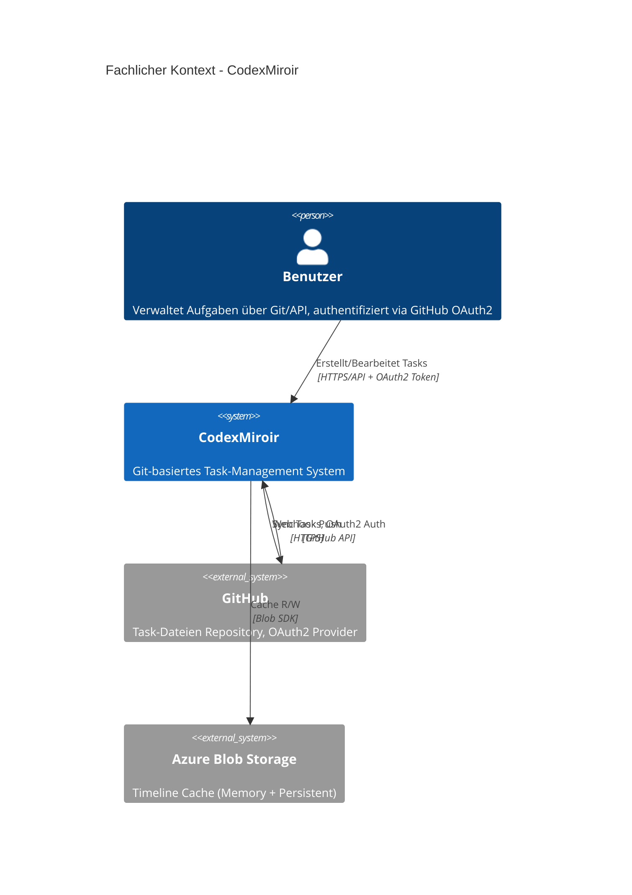
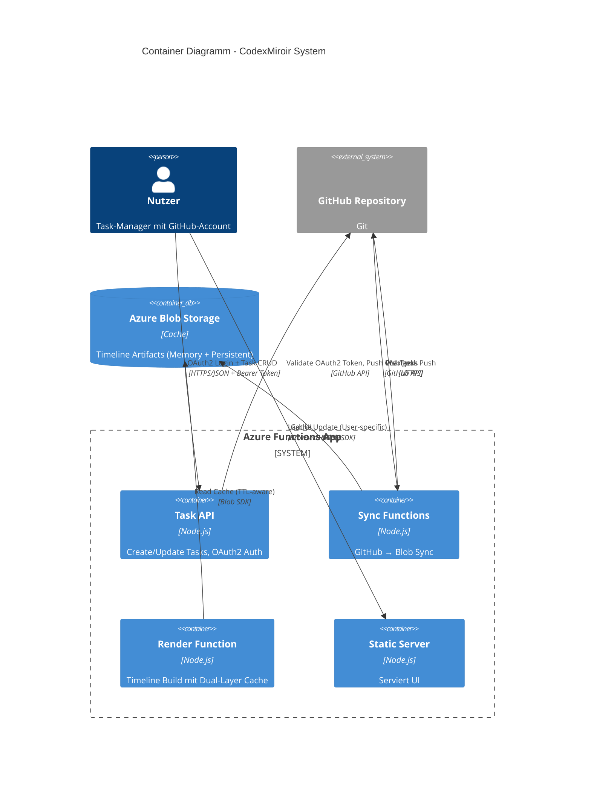
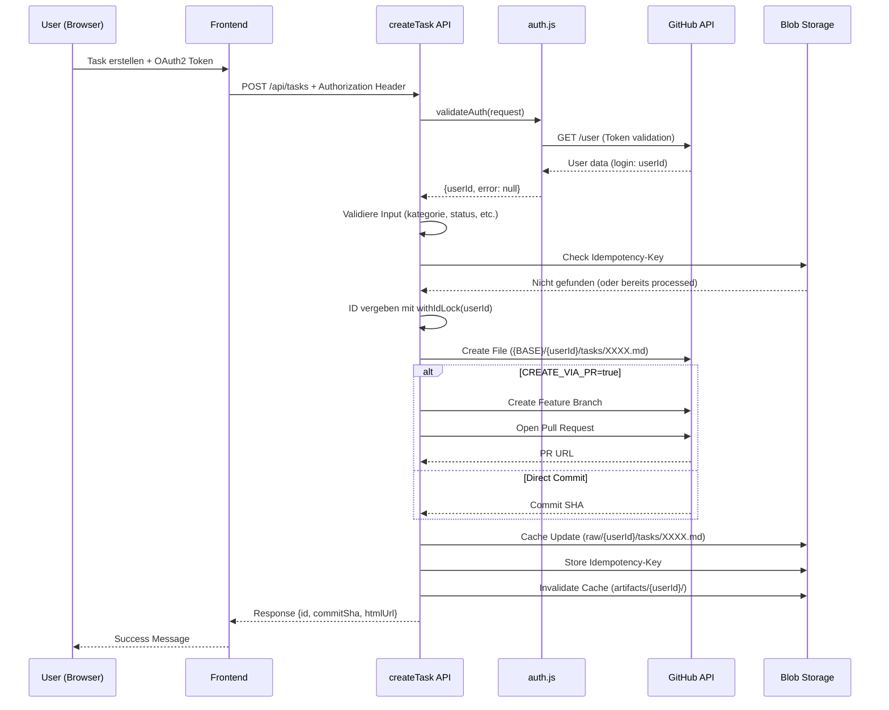
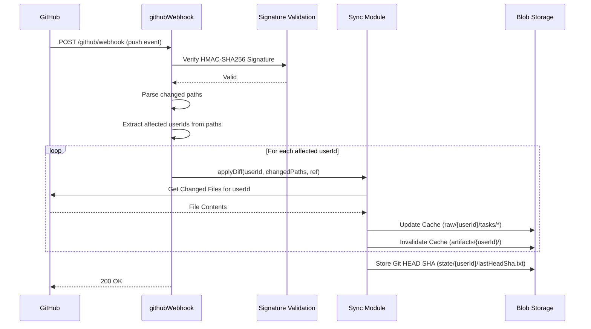
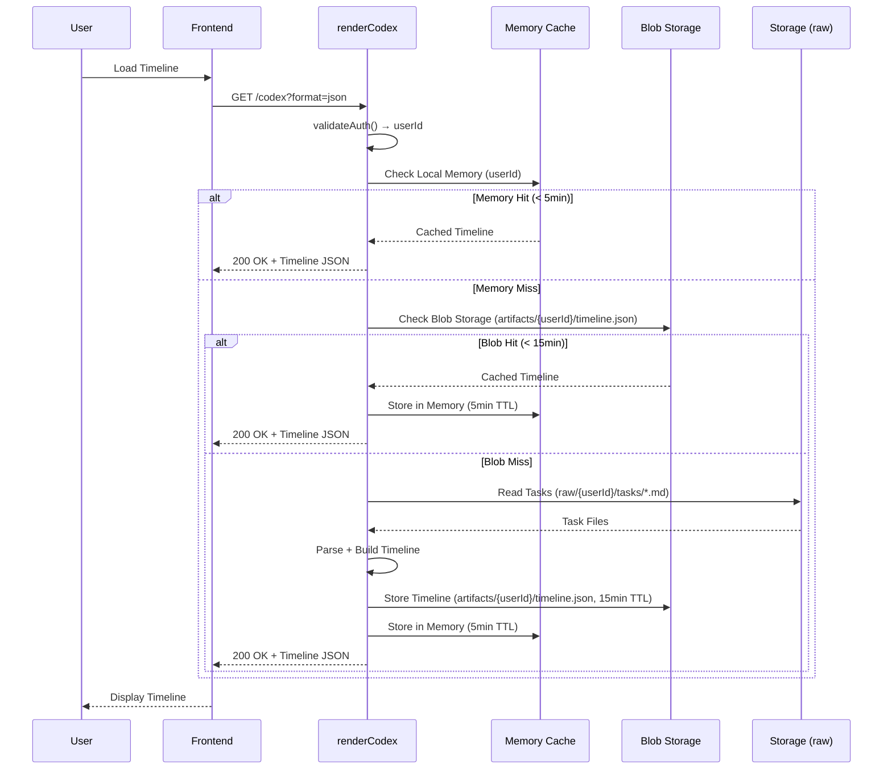
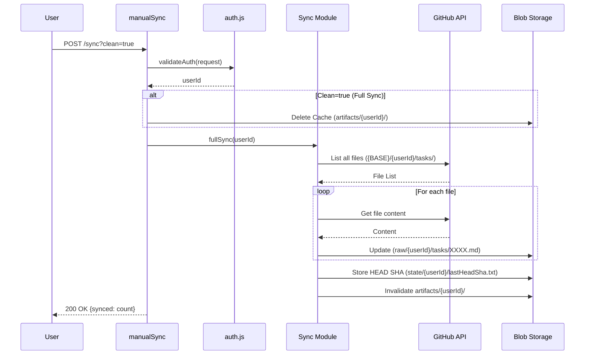

# arc42 – Architektur-Dokumentation

**CodexMiroir** - Git-basiertes Task-Management-System nach dem Spartarégime-Prinzip

**Über arc42:** Template zur Dokumentation von Software- und Systemarchitekturen.  
Template Version 8.2 DE. Created, maintained and © by Dr. Peter Hruschka, Dr. Gernot Starke and contributors. Siehe <https://arc42.org>.

## 1. Einführung und Ziele

### 1.1 Anforderungen und Ziele

**CodexMiroir** ist ein minimalistisches Task-Management-System nach dem **Spartarégime-Prinzip**: Keine Prio, kein Snooze, keine fancy Felder - nur nummerierte Markdown-Dateien.

#### Kernprinzipien:
- **Git-basiert**: Tasks leben als Markdown-Dateien in GitHub Repository
- **Nummerierte Dateien**: 0000.md bis 9999.md im Ordner `codex-miroir/tasks/`
- **Dateiname = Priorität**: Niedrigere Nummer wird zuerst eingeplant
- **Timeline-Rendering**: Deterministische Berechnung der Wochenansicht
- **Webhook-Sync**: GitHub → Azure Function → Blob Storage Cache
- **Automatischer Sync**: GitHub Webhook → Azure Function → Cache-Update
- **Fixed-First-Logik**: Tasks mit fixedSlot werden zuerst platziert
- **Auto-Fill**: Restliche Tasks nach Dateinamen-Reihenfolge

#### Funktionale Anforderungen:
- Task-Verwaltung über Git (Markdown-Dateien in GitHub)
- CRUD-Operationen für Tasks via REST API
- Automatischer Sync von GitHub zu Azure Blob Storage
- Timeline-Rendering (JSON/HTML) mit Dual-Layer-Caching
- Deterministische Auto-Fill-Logik (Fixed first, dann nach Dateinamen)
- Kategorie-basierte Planung (arbeit = Mo-Fr, privat = Sa-So)
- GitHub Webhook-Integration für automatischen Sync
- GitHub OAuth2 Authentifizierung
- User-spezifische Task-Verwaltung und Cache-Isolation
- Idempotenz-Support für Task-Erstellung
- Pull Request Support (optional)

### 1.2 Qualitätsziele

| Priorität | Qualitätsziel | Szenario |
|-----------|---------------|----------|
| 1 | **Einfachheit** | Git-basierte Task-Verwaltung, minimales API-Setup, keine komplexen Abhängigkeiten |
| 2 | **Robustheit** | Validierung aller Inputs, Idempotenz-Support, Fehlerbehandlung, Token-Sicherheit |
| 3 | **Performance** | Dual-Layer Caching (Memory + Blob), schnelle Timeline-Berechnung, User-spezifische Cache-Invalidierung |
| 4 | **Sicherheit** | GitHub OAuth2 Authentifizierung, User-Isolierung, HTTPS-only, Token-basierter Zugriff |
| 5 | **Verfügbarkeit** | Azure Functions Skalierung, GitHub als Source of Truth, Cache-TTL Management |
| 6 | **Erweiterbarkeit** | PR-Support, modulare Architektur, ES Modules, klar getrennte Funktionen |

#### Stakeholder

| Rolle | Kontakt | Erwartungshaltung |
|-------|---------|-------------------|
| **Einzelnutzer** | Endbenutzer | Einfache, fokussierte Task-Verwaltung ohne Ablenkung |
| **Entwickler** | merlinbecker | Wartbare, erweiterbare Codebase mit Clean Code Prinzipien |
| **Azure-Operator** | DevOps | Kostengünstige, skalierbare Azure Functions Deployment |

## 2. Randbedingungen

### Technische Randbedingungen

- **Plattform**: Azure Functions v4 mit Node.js 18+ (ES Modules)
- **Datenspeicher**: 
  - Azure Blob Storage für Cache (raw tasks, timeline artifacts, state)
  - GitHub als Source of Truth für Tasks
- **Frontend**: Statische Web-UI (Vanilla JavaScript, Alpine.js)
- **Sync**: GitHub API + Webhook für automatischen Pull
- **Authentifizierung**: 
  - GitHub OAuth2 für User-Authentifizierung
  - GitHub Webhook Secret für Push-Events
  - GitHub Personal Access Token für API-Zugriff
- **Cache-Strategie**: Dual-Layer Cache (Local Memory 5min + Blob Storage 15min TTL)

### Organisatorische Randbedingungen

- **Team**: Ein Entwickler (merlinbecker)
- **Budget**: Kostengünstige Azure-Services (Pay-as-you-use)
- **Zeitrahmen**: Iterative Entwicklung
- **Dokumentation**: Deutsche Sprache, arc42-Standard
- **Versionskontrolle**: Git, GitHub Repository
- **CI/CD**: GitHub Actions (optional), manuelle Deployments via Azure Functions Core Tools

### Konventionen

- **Datumsformat**: dd.mm.yyyy (z.B. "02.10.2025")
- **Zeitslots**: morgens, nachmittags, abends
- **Sprache**: Deutsche Feldnamen im YAML, englische Codebase
- **Code-Style**: ES Modules, async/await Pattern, funktional wo möglich
- **Dateinamen**: Tasks als `####.md` (0000-9999)
- **Git-Commits**: Aussagekräftige Commit-Messages
- **API-Routen**: `/api` Prefix für alle API-Endpoints

## 3. Kontextabgrenzung

### 3.1 Fachlicher Kontext



**Externe Schnittstellen:**

| System | Beschreibung | Protokoll |
|--------|--------------|-----------|
| GitHub Repository | Source of Truth für Tasks, OAuth2 Provider | GitHub REST API v3, Webhooks |
| Azure Blob Storage | Cache-Layer für Tasks und Timeline-Artifacts | Azure Blob Storage SDK |
| Browser (Frontend) | Statische Web-UI für Task-Management | HTTPS, REST API |

### 3.2 Technischer Kontext

**Kommunikationskanäle:**

1. **User → CodexMiroir (Frontend)**
   - Protokoll: HTTPS
   - Format: HTML, JavaScript, CSS (statisch)
   - Authentifizierung: GitHub OAuth2 Token in Authorization Header

2. **Frontend → Backend API**
   - Protokoll: HTTPS, REST
   - Format: JSON
   - Authentifizierung: `Authorization: Bearer <github_token>`
   - User-Identifizierung: Automatisch aus Token extrahiert

3. **GitHub → CodexMiroir (Webhook)**
   - Protokoll: HTTPS, POST
   - Format: JSON (Push Event Payload)
   - Authentifizierung: HMAC-SHA256 Signature mit Webhook Secret
   - Trigger: Git Push Events

4. **CodexMiroir → GitHub API**
   - Protokoll: HTTPS, REST
   - Format: JSON
   - Authentifizierung: GitHub Personal Access Token oder OAuth2 Token
   - Operationen: Lesen/Schreiben von Files, User-Info, PR-Erstellung

5. **CodexMiroir → Azure Blob Storage**
   - Protokoll: HTTPS
   - SDK: @azure/storage-blob
   - Authentifizierung: Connection String
   - Operationen: CRUD für Blobs, Locks für ID-Verwaltung

## 4. Lösungsstrategie

### Strategische Architekturentscheidungen

1. **GitHub als Source of Truth**
   - *Begründung*: Git-Historie, einfache Versionierung, Backup inklusive, kollaboratives Arbeiten möglich
   - *Konsequenz*: Alle Änderungen werden in Git gepersisted, Azure Blob Storage ist nur Cache

2. **Azure Blob Storage für Dual-Layer Cache**
   - *Begründung*: Kosteneffizient, einfache API, hohe Performance, TTL-Support
   - *Architektur*: 
     - Layer 1: Local Memory (5 Minuten TTL, flüchtig, pro Function-Instance)
     - Layer 2: Blob Storage (15 Minuten TTL, persistent, überlebt Cold Starts)
   - *Konsequenz*: Cache-Miss führt zu Rebuild aus Storage, nicht zu Git-Pull (schneller)

3. **Webhook-basierter Sync**
   - *Begründung*: Echtzeit-Updates, keine Polling-Kosten, event-driven
   - *Konsequenz*: User-spezifische Cache-Invalidierung nur für betroffene User

4. **GitHub OAuth2 Authentifizierung**
   - *Begründung*: User-Identifikation über GitHub, keine separate User-Verwaltung, Token-basiert
   - *User-Isolation*: Tasks in user-spezifischen Ordnern (`{userId}/tasks/`)
   - *Konsequenz*: Automatische User-Extraktion aus Token, keine manuelle UserId-Eingabe nötig

5. **Idempotenz-Support**
   - *Begründung*: Verhindert doppelte Tasks bei Retry-Logic, robuste API
   - *Implementation*: Idempotency-Key Header + Blob Storage für Tracking
   - *Konsequenz*: Sichere Task-Erstellung auch bei Netzwerkfehlern

6. **PR-Support (optional)**
   - *Begründung*: Review-Workflow, Safe-Deployment möglich, Code-Review für Tasks
   - *Implementation*: `CREATE_VIA_PR` Flag aktiviert Feature-Branch + PR-Erstellung
   - *Konsequenz*: Flexibilität zwischen direktem Commit und Review-Prozess

7. **ES Modules statt CommonJS**
   - *Begründung*: Modern JavaScript, bessere Tree-Shaking, native Unterstützung
   - *Konsequenz*: Alle Imports/Exports nutzen ESM-Syntax

### Technologie-Entscheidungen

- **Azure Functions v4**: Serverless, Auto-Scaling, Pay-per-Use
- **Node.js 18+**: LTS-Support, moderne JavaScript-Features
- **Alpine.js**: Lightweight Frontend Framework (15kb), reaktive UI
- **Vanilla JavaScript**: Keine schweren Frameworks, schnelle Load-Zeit
- **Mermaid**: Diagramme in Markdown, keine externen Tools nötig

## 5. Bausteinsicht

### 5.1 Whitebox Gesamt-System



**Komponenten-Übersicht:**

| Komponente | Verantwortung | Technologie |
|------------|---------------|-------------|
| Task API | CRUD für Tasks, OAuth2 Validierung, Idempotenz | Azure Functions (HTTP) |
| Sync Functions | GitHub-Azure Synchronisation, Diff-based Updates | Azure Functions (HTTP + Webhook) |
| Render Function | Timeline-Berechnung, Dual-Layer Caching | Azure Functions (HTTP) |
| Static Server | Frontend ausliefern (public access) | Azure Functions (HTTP) |
| GitHub Repository | Source of Truth, OAuth2 Provider | Git, GitHub API |
| Azure Blob Storage | Cache-Layer (raw, artifacts, state) | Blob Storage SDK |

### 5.2 Bausteine

#### API Functions (src/)

**createTask.js**
- **Route**: POST `/api/tasks`
- **Auth**: anonymous (OAuth2 über validateAuth)
- **Funktion**: Erstellt neuen Task in GitHub
- **Features**: 
  - Validierung (kategorie, status, deadline, fixedSlot)
  - Idempotenz-Key Support
  - PR-Support (wenn CREATE_VIA_PR=true)
  - User-spezifischer Pfad: `{BASE}/{userId}/tasks/{id}.md`
  - Automatische ID-Vergabe mit Lock
- **Response**: Task-ID, GitHub Commit SHA, HTML URL

**updateTask.js**
- **Route**: PUT/PATCH `/api/tasks/{id}`
- **Auth**: anonymous (OAuth2 über validateAuth)
- **Funktion**: Aktualisiert existierenden Task
- **Features**: 
  - Partielle Updates
  - Validierung
  - PR-Support
  - User-spezifischer Zugriff

**githubWebhook.js**
- **Route**: POST `/github/webhook`
- **Auth**: anonymous (Signature-Validierung)
- **Funktion**: GitHub Webhook Handler
- **Features**: 
  - HMAC-SHA256 Signature-Validierung
  - Diff-basierter Sync (nur geänderte Files)
  - User-spezifische Cache-Invalidierung
  - Erkennung betroffener User aus Dateipfaden

**manualSync.js**
- **Route**: GET/POST `/sync`
- **Auth**: anonymous (OAuth2 über validateAuth)
- **Funktion**: Manueller Sync Trigger
- **Features**: 
  - Full-Sync Option (`?clean=true`)
  - User-spezifischer Sync
  - Background-Sync Support

**renderCodex.js**
- **Route**: GET `/codex`
- **Auth**: anonymous (OAuth2 über validateAuth)
- **Funktion**: Timeline Rendering
- **Features**: 
  - JSON/HTML Output (`?format=json|html`)
  - Dual-Layer Caching:
    - Layer 1: Local Memory (5min TTL)
    - Layer 2: Blob Storage (15min TTL)
  - TTL-basierte Cache-Validierung
  - User-spezifische Timeline

**serveStatic.js**
- **Route**: GET `/{*path}`
- **Auth**: anonymous (public access)
- **Funktion**: Statische UI ausliefern
- **Features**: 
  - Content-Type Detection
  - File Serving aus public/ Ordner
  - Fallback zu index.html

#### Shared Modules (shared/)

**auth.js**
- **Funktionen**:
  - `validateAuth(request)`: OAuth2 Token Validierung
  - `extractUserId(request)`: User-ID aus Token extrahieren
- **Unterstützung**: Authorization Header + Session Cookie
- **GitHub API**: `/user` Endpoint für Token-Validierung
- **Error Handling**: 401 Unauthorized bei ungültigem Token

**storage.js**
- **Blob Client**: Azure Blob Storage Verbindung
- **Funktionen**:
  - `readBlob(path)`: Blob lesen
  - `writeBlob(path, content)`: Blob schreiben
  - `deleteBlob(path)`: Blob löschen
  - `listBlobs(prefix)`: Blobs auflisten
  - `invalidateCacheForUser(userId)`: User-spezifische Cache-Invalidierung
  - `withIdLock(userId, fn)`: ID-Lock für Task-Erstellung
- **Cache-Struktur**:
  - `raw/{userId}/tasks/*.md`: Gecachte Task-Dateien
  - `artifacts/{userId}/timeline_*.json`: Timeline-Artifacts
  - `state/{userId}/nextId.txt`: Nächste Task-ID
  - `state/{userId}/lastHeadSha.txt`: Letzter Git HEAD SHA

**sync.js**
- **Funktionen**:
  - `fullSync(userId)`: Kompletter Sync von GitHub
  - `applyDiff(userId, changedPaths, ref)`: Diff-basierter Sync
  - `pullTasksFromGithub(userId)`: Tasks aus GitHub laden
- **GitHub API Integration**: Octokit für API-Zugriff
- **User-Isolation**: Alle Sync-Operationen user-spezifisch

**parsing.js**
- **Funktionen**:
  - `parseTaskFile(content)`: YAML Frontmatter + Markdown Body parsen
  - `validateTask(task)`: Task-Validierung
  - `serializeTask(task)`: Task zu Markdown serialisieren
- **Validierungen**:
  - typ: task (Pflicht)
  - kategorie: arbeit | privat (Pflicht)
  - status: offen | abgeschlossen | abgebrochen (Pflicht)
  - deadline: dd.mm.yyyy (Optional)
  - fixedSlot.zeit: morgens | nachmittags | abends (Optional)

**id.js**
- **Funktionen**:
  - `withIdLock(userId, fn)`: Atomare ID-Vergabe mit Blob Lock
  - `getNextId(userId)`: Nächste freie ID ermitteln
- **Lock-Mechanismus**: Blob Lease für Race-Condition-Schutz

## 6. Laufzeitsicht

### Task Creation Flow (mit OAuth2)



### GitHub Webhook Flow (User-spezifisch)



### Timeline Rendering mit Dual-Layer Cache



### Manual Sync Flow



## 7. Verteilungssicht

### Infrastruktur-Übersicht

```
┌─────────────────────────────────────────────────────────────┐
│                    Azure Cloud                              │
│  ┌────────────────────────────────────────────────────┐    │
│  │  Azure Functions App (codexmiroir-func)            │    │
│  │  - Region: West Europe                             │    │
│  │  - Consumption Plan (Serverless)                   │    │
│  │  - Runtime: Node.js 18                             │    │
│  │  - Functions Version: 4                            │    │
│  │  ┌────────────────────────────────────────────┐    │    │
│  │  │  HTTP Functions:                           │    │    │
│  │  │  - createTask, updateTask                  │    │    │
│  │  │  - githubWebhook, manualSync               │    │    │
│  │  │  - renderCodex, serveStatic                │    │    │
│  │  └────────────────────────────────────────────┘    │    │
│  └────────────────────────────────────────────────────┘    │
│                                                             │
│  ┌────────────────────────────────────────────────────┐    │
│  │  Azure Blob Storage (codexmiroirstorage)           │    │
│  │  - Region: West Europe                             │    │
│  │  - Redundancy: LRS (Locally Redundant)            │    │
│  │  - Container: codex-cache                          │    │
│  │    ├── raw/{userId}/tasks/*.md                     │    │
│  │    ├── artifacts/{userId}/timeline_*.json          │    │
│  │    └── state/{userId}/{nextId|lastHeadSha}.txt     │    │
│  └────────────────────────────────────────────────────┘    │
└─────────────────────────────────────────────────────────────┘

┌─────────────────────────────────────────────────────────────┐
│                    GitHub.com                               │
│  ┌────────────────────────────────────────────────────┐    │
│  │  Repository: {owner}/{repo}                        │    │
│  │  ├── {BASE_PATH}/                                  │    │
│  │  │   ├── user1/tasks/                              │    │
│  │  │   │   ├── 0000.md, 0001.md, ...                │    │
│  │  │   ├── user2/tasks/                              │    │
│  │  │   │   └── ...                                   │    │
│  │  │                                                  │    │
│  │  └── Webhooks:                                     │    │
│  │      - Push Events → Azure Function               │    │
│  │      - HMAC-SHA256 Signature                      │    │
│  └────────────────────────────────────────────────────┘    │
│                                                             │
│  OAuth2 Provider:                                          │
│  - Authorization Endpoint                                  │
│  - Token Endpoint                                          │
│  - User API (/user)                                        │
└─────────────────────────────────────────────────────────────┘

┌─────────────────────────────────────────────────────────────┐
│                    Client (Browser)                         │
│  - Static HTML/JS/CSS (Alpine.js)                          │
│  - OAuth2 Token in localStorage                            │
│  - API Calls mit Authorization Header                      │
└─────────────────────────────────────────────────────────────┘
```

### Deployment-Topologie

**Lokale Entwicklung:**
- Azure Functions Core Tools (localhost:7071)
- Azurite Emulator für Blob Storage (optional)
- GitHub API über Internet
- OAuth2 Token manuell bereitgestellt

**Production (Azure):**
- Azure Functions Consumption Plan
- Azure Blob Storage (LRS)
- GitHub API über Internet
- GitHub OAuth2 Callback URL konfiguriert
- Environment Variables in Azure Function App Settings

### Netzwerk und Sicherheit

- **HTTPS only**: Alle Verbindungen verschlüsselt
- **Firewall**: Azure Functions hinter Azure Front Door (optional)
- **Secrets Management**: Environment Variables in Azure
- **CORS**: Konfiguriert für Frontend-Domain
- **OAuth2**: Token-basierte Authentifizierung
- **Webhook Signature**: HMAC-SHA256 für GitHub Push Events

## 8. Querschnittliche Konzepte

### 8.1 Architektur- und Entwurfsmuster

#### Serverless Architecture (Azure Functions)
- **Pattern**: Function-as-a-Service (FaaS)
- **Vorteile**: Auto-Scaling, Pay-per-Use, keine Infrastruktur-Verwaltung
- **Nachteile**: Cold Starts, Execution Time Limits
- **Mitigation**: Dual-Layer Cache (Memory + Blob) für schnelle Responses

#### Repository Pattern (GitHub als Source of Truth)
- **Pattern**: Single Source of Truth mit Event Sourcing
- **Implementation**: Alle Änderungen via Git Commits
- **Vorteile**: Vollständige Historie, Versionierung, Rollback möglich
- **Cache**: Azure Blob Storage als Read-Through Cache

#### OAuth2 Authorization Code Flow
- **Pattern**: Delegated Authorization
- **Implementation**: GitHub als OAuth2 Provider
- **Token-Übermittlung**: Authorization Header (Bearer Token)
- **User-Extraktion**: GitHub API `/user` Endpoint
- **Fallback**: Session Cookie Support

#### Multi-Layer Caching Strategy
- **Layer 1 (Memory)**: 
  - TTL: 5 Minuten
  - Scope: Pro Function-Instance
  - Volatil: Verloren bei Cold Start
  - Latenz: 1-5ms
  
- **Layer 2 (Blob Storage)**:
  - TTL: 15 Minuten
  - Scope: Global, persistent
  - Überlebt Cold Starts
  - Latenz: 50-100ms
  
- **Layer 3 (Rebuild)**:
  - Wenn beide Cache-Layers miss
  - Rebuild aus Storage (nicht Git!)
  - Latenz: 2-5 Sekunden

#### Event-Driven Sync (Webhook Pattern)
- **Trigger**: GitHub Push Event
- **Handler**: HMAC-SHA256 Signature Validation
- **Processing**: Diff-based, nur geänderte Files
- **Cache-Invalidierung**: User-spezifisch, nicht global

#### Idempotency Pattern
- **Implementierung**: Idempotency-Key Header
- **Storage**: Blob Storage für Key-Tracking
- **TTL**: 24 Stunden
- **Use Case**: Vermeidung doppelter Tasks bei API-Retries

#### User Isolation Pattern
- **Pfad-Schema**: `{BASE}/{userId}/tasks/`
- **Cache-Schema**: `raw/{userId}/`, `artifacts/{userId}/`, `state/{userId}/`
- **Vorteil**: Keine Kollisionen, unabhängige Cache-Lifecycles
- **Extraktion**: Automatisch aus OAuth2 Token

### 8.2 Unter-the-Hood

#### Task-Dateiformat

**YAML Frontmatter + Markdown Body:**
```yaml
---
typ: task
kategorie: arbeit | privat
status: offen | abgeschlossen | abgebrochen
tags: [tag1, tag2]
deadline: dd.mm.yyyy
fixedSlot:
  datum: dd.mm.yyyy
  zeit: morgens | nachmittags | abends
---

# Task Title

Task description in Markdown...
```

#### Timeline-Berechnung (Deterministische Logik)

1. **Phase 1: Fixed Slots platzieren**
   - Alle Tasks mit `fixedSlot` werden zuerst platziert
   - Slots werden blockiert
   
2. **Phase 2: Auto-Fill**
   - Tasks ohne fixedSlot nach Dateinamen sortiert (0000 zuerst)
   - Kategorie-Regeln:
     - `arbeit`: Mo-Fr, morgens → nachmittags (kein abends)
     - `privat`: Sa-So, morgens → nachmittags (kein abends)
   - Freie Slots ab heute vorwärts suchen
   
3. **Phase 3: Domino-Logik**
   - Bei Konflikten: Tasks verschieben
   - morgens → nachmittags → abends → nächster Tag

#### ID-Vergabe mit Lock

```javascript
// Atomare ID-Vergabe über Blob Lease
async function withIdLock(userId, fn) {
  const lockBlob = `state/${userId}/id.lock`;
  const lease = await acquireLease(lockBlob, 30); // 30 Sekunden
  try {
    const nextId = await getNextId(userId);
    const result = await fn(nextId);
    await incrementId(userId);
    return result;
  } finally {
    await releaseLease(lease);
  }
}
```

#### Diff-based Sync

Webhook liefert nur geänderte Pfade:
```javascript
const changedFiles = event.commits
  .flatMap(c => [...c.added, ...c.modified, ...c.removed])
  .filter(path => path.startsWith(`${BASE}/`) && path.endsWith('.md'));

// Nur diese Files syncen, nicht alles
await applyDiff(userId, changedFiles, event.after);
```

#### OAuth2 Token Validation

```javascript
async function validateAuth(request) {
  // 1. Extract Token (Header > Cookie)
  const token = extractToken(request);
  if (!token) return {error: 401};
  
  // 2. Validate with GitHub API
  const response = await fetch('https://api.github.com/user', {
    headers: {'Authorization': `Bearer ${token}`}
  });
  
  if (!response.ok) return {error: 401};
  
  // 3. Extract userId
  const user = await response.json();
  return {userId: user.login};
}
```

#### Frontend OAuth2 Flow

```javascript
// 1. Check URL for token (after OAuth callback)
const urlParams = new URLSearchParams(window.location.search);
let token = urlParams.get('token');

// 2. Fallback to localStorage
if (!token) {
  token = localStorage.getItem('codexmiroir_token');
}

// 3. If no token, show login button
if (!token) {
  document.getElementById('loginBtn').style.display = 'block';
  return;
}

// 4. Store token
localStorage.setItem('codexmiroir_token', token);

// 5. Use token in all API calls
fetch('/api/tasks', {
  headers: {
    'Authorization': `Bearer ${token}`,
    'Content-Type': 'application/json'
  }
});
```

## 9. Entwurfsentscheidungen

### ADR-001: Git als Source of Truth

**Status**: Accepted  
**Kontext**: Tasks müssen persistent gespeichert werden  
**Entscheidung**: GitHub Repository als primäre Datenquelle  
**Begründung**:
- Vollständige Historie (Git Commits)
- Versionskontrolle inklusive
- Einfaches Backup (Git Clone)
- Kollaboratives Arbeiten möglich
- Kein separates Datenbank-Setup nötig

**Konsequenzen**:
- ✅ Einfache Architektur
- ✅ Kostenlos (GitHub Free)
- ❌ Sync-Latenz (API-Calls zu GitHub)
- ➡️ Mitigation: Azure Blob Storage als Cache

### ADR-002: GitHub OAuth2 statt Function Keys

**Status**: Accepted  
**Kontext**: User-Authentifizierung und -Identifikation  
**Entscheidung**: GitHub OAuth2 Authorization Code Flow  
**Begründung**:
- User-Identifikation über GitHub-Username
- Keine separate User-Verwaltung nötig
- Token-basiert, leicht widerrufbar
- User-spezifische Task-Isolation
- Granulare Scopes für API-Zugriff

**Konsequenzen**:
- ✅ Automatische User-Extraktion
- ✅ User-Isolation out-of-the-box
- ✅ Keine manuelle UserId-Eingabe
- ❌ Abhängigkeit von GitHub OAuth
- ➡️ Fallback: Personal Access Tokens

### ADR-003: User-spezifische Ordnerstruktur

**Status**: Accepted  
**Kontext**: Multi-User-Support ohne Kollisionen  
**Entscheidung**: Tasks in `{BASE}/{userId}/tasks/` statt shared folder  
**Begründung**:
- Vermeidung von ID-Kollisionen
- User-spezifische Cache-Invalidierung
- Einfache Access-Control
- Skalierbar für viele User

**Konsequenzen**:
- ✅ Keine Race Conditions bei ID-Vergabe
- ✅ Unabhängige Cache-Lifecycles
- ❌ Migration alter Tasks nötig
- ➡️ Automatische Erkennung betroffener User bei Webhook

### ADR-004: Dual-Layer Caching (Memory + Blob)

**Status**: Accepted  
**Kontext**: Cold Start Performance vs. Cache Persistence  
**Entscheidung**: Zwei Cache-Layer mit unterschiedlichen TTLs  
**Begründung**:
- Memory Cache: Ultra-schnell (1-5ms) für Hot Paths
- Blob Cache: Persistent, überlebt Cold Starts
- TTL-basiert statt Version-basiert
- Automatische Invalidierung nach Timeout

**Konsequenzen**:
- ✅ Schnelle Responses (Memory Hit)
- ✅ Robustheit bei Cold Start (Blob Hit)
- ✅ Reduzierte GitHub API Calls
- ❌ Komplexere Cache-Logik
- ➡️ Cache-Miss: Rebuild aus Storage (nicht Git!)

### ADR-005: Idempotenz via Blob Storage

**Status**: Accepted  
**Kontext**: Vermeidung doppelter Tasks bei API-Retries  
**Entscheidung**: Idempotency-Key Header mit Blob Storage Tracking  
**Begründung**:
- Robuste API bei Netzwerkfehlern
- Client kann safe retries machen
- 24h TTL für Keys ausreichend
- Blob Storage als persistenter Store

**Konsequenzen**:
- ✅ Idempotente Task-Erstellung
- ✅ Bessere Client-Experience
- ❌ Zusätzliche Blob Storage Calls
- ➡️ Optional: Client muss Key generieren

### ADR-006: ES Modules statt CommonJS

**Status**: Accepted  
**Kontext**: Modern JavaScript in Node.js 18+  
**Entscheidung**: ES Modules (`import/export`) für gesamte Codebase  
**Begründung**:
- Native Unterstützung in Node.js 18+
- Besseres Tree-Shaking
- Moderner Standard
- Klarere Syntax

**Konsequenzen**:
- ✅ Zukunftssicher
- ✅ Bessere IDE-Unterstützung
- ❌ Keine Backward-Kompatibilität mit altem Code
- ➡️ package.json: `"type": "module"`

### ADR-007: PR-Support als optionales Feature

**Status**: Accepted  
**Kontext**: Review-Workflow für Tasks gewünscht  
**Entscheidung**: `CREATE_VIA_PR` Flag für Optional PR-Erstellung  
**Begründung**:
- Flexibilität: Direkter Commit oder Review-Prozess
- Einfache Aktivierung via Environment Variable
- Kein Breaking Change für bestehende Deployments

**Konsequenzen**:
- ✅ Review-Workflow möglich
- ✅ Safe-Deployment Option
- ❌ Zusätzliche GitHub API Calls
- ➡️ Standard: `false` (Direct Commit)

## 10. Qualitätsszenarien

### Performance-Szenarien

**QS-1: Timeline-Rendering unter 100ms**
- **Stimulus**: User lädt Timeline
- **Umgebung**: Production, warme Function-Instance
- **Antwort**: Memory Cache Hit
- **Metrik**: < 100ms Response Time
- **Status**: ✅ Erreicht (Memory Cache: 1-5ms)

**QS-2: Cold Start unter 3 Sekunden**
- **Stimulus**: Erste Anfrage nach Cold Start
- **Umgebung**: Production, kalte Function-Instance
- **Antwort**: Blob Cache Hit
- **Metrik**: < 3s Response Time
- **Status**: ✅ Erreicht (Blob Cache: 50-100ms + Rebuild: 2s)

### Sicherheits-Szenarien

**QS-3: Ungültiger OAuth2 Token**
- **Stimulus**: API-Call mit ungültigem Token
- **Umgebung**: Production
- **Antwort**: 401 Unauthorized
- **Metrik**: Kein Zugriff auf Daten
- **Status**: ✅ Implementiert (validateAuth)

**QS-4: Webhook ohne Signature**
- **Stimulus**: POST /github/webhook ohne HMAC-Signature
- **Umgebung**: Production
- **Antwort**: 401 Unauthorized
- **Metrik**: Kein Cache-Update
- **Status**: ✅ Implementiert (HMAC-SHA256 Validation)

### Robustheit-Szenarien

**QS-5: GitHub API Ausfall**
- **Stimulus**: GitHub API nicht erreichbar
- **Umgebung**: Production, Sync-Operation
- **Antwort**: Fallback auf Blob Cache
- **Metrik**: Timeline bleibt verfügbar (stale data)
- **Status**: ✅ Implementiert (Cache Fallback)

**QS-6: Doppelte Task-Erstellung**
- **Stimulus**: Client sendet Request zweimal (Retry)
- **Umgebung**: Production, Netzwerkfehler
- **Antwort**: Zweiter Request gibt existierende Task-ID zurück
- **Metrik**: Nur eine Task erstellt
- **Status**: ✅ Implementiert (Idempotency-Key)

### Wartbarkeits-Szenarien

**QS-7: Neue API-Funktion hinzufügen**
- **Stimulus**: Entwickler fügt neue Function hinzu
- **Umgebung**: Development
- **Antwort**: Neue JS-Datei in `src/`, Export in `functions.js`
- **Metrik**: < 30 Minuten Aufwand
- **Status**: ✅ Einfache Erweiterung

**QS-8: Cache-Strategie ändern**
- **Stimulus**: TTL anpassen oder Cache-Layer hinzufügen
- **Umgebung**: Development
- **Antwort**: Änderung in `renderCodex.js`
- **Metrik**: < 1 Stunde Aufwand
- **Status**: ✅ Modularer Aufbau

## 11. Risiken und technische Schulden

### Identifizierte Risiken

#### Hohe Risiken

**R1: GitHub Token Sicherheit** 🔴
- **Beschreibung**: GitHub Token hat vollen Repo-Zugriff (scope: `repo`)
- **Auswirkung**: Kompromittierung ermöglicht Code-Änderungen, Datenlecks
- **Wahrscheinlichkeit**: Mittel
- **Mitigation**: 
  - Token nur mit minimal nötigen Scopes
  - Regelmäßige Token-Rotation (alle 90 Tage)
  - Environment Variables statt Hardcoding
  - Token niemals in Git committen

**R2: OAuth2 Token in localStorage** 🔴
- **Beschreibung**: Frontend speichert OAuth2 Token in Browser localStorage
- **Auswirkung**: XSS-Angriffe können Token stehlen
- **Wahrscheinlichkeit**: Niedrig (CSP Headers aktiv)
- **Mitigation**:
  - Content-Security-Policy Headers
  - HTTPOnly Cookies als Alternative (langfristig)
  - Token Rotation
  - Kurze Token-Lebensdauer

**R3: ID-Kollisionen bei Concurrent Requests** ⚠️
- **Beschreibung**: `withIdLock()` nutzt Blob Storage Lease
- **Auswirkung**: Bei Blob Storage Ausfall können Kollisionen auftreten
- **Wahrscheinlichkeit**: Niedrig
- **Mitigation**: 
  - Idempotenz-Keys verwenden
  - Race-Condition-Tests
  - Fallback auf GUID-basierte IDs (langfristig)

#### Mittlere Risiken

**R4: GitHub API Rate Limits**
- **Beschreibung**: GitHub API hat Rate Limits (5000 req/h authenticated)
- **Auswirkung**: Bei vielen Tasks kann Sync geblockt werden
- **Wahrscheinlichkeit**: Niedrig (Single User meist < 100 req/h)
- **Mitigation**: 
  - Diff-basierter Sync (nicht Full-Sync)
  - Dual-Layer Caching reduziert API Calls
  - Exponential Backoff bei Rate Limit
  - GitHub API Response Headers prüfen (X-RateLimit-Remaining)

**R5: Blob Storage Kosten bei Skalierung**
- **Beschreibung**: Viele Cache-Updates und Reads können teuer werden
- **Auswirkung**: Unerwartete monatliche Kosten
- **Wahrscheinlichkeit**: Mittel (bei vielen Usern)
- **Mitigation**: 
  - Azure Cost Management Alerts einrichten
  - Storage Analytics Monitoring
  - Archive-Tier für alte Timeline-Artifacts
  - Memory Cache reduziert Blob Reads (80%+ Hit Rate)

**R6: GitHub als Single Point of Failure**
- **Beschreibung**: Bei GitHub Ausfall ist System nicht nutzbar
- **Auswirkung**: Keine neuen Tasks, kein Sync möglich
- **Wahrscheinlichkeit**: Sehr niedrig (GitHub 99.9% SLA)
- **Mitigation**:
  - Cache-Fallback für Read Operations
  - Graceful Degradation (stale data besser als gar keine)
  - GitHub Status API überwachen

### Technische Schulden

**TD1: Fehlende End-to-End Tests** ⚠️
- **Problem**: Keine automatisierten Tests für GitHub-Integration, OAuth2 Flow
- **Auswirkung**: Regressions schwer zu erkennen, manuelle Tests zeitaufwendig
- **Aufwand**: 2-3 Tage
- **Priorität**: Mittel
- **Vorschlag**: Playwright E2E Tests mit Mock GitHub API

**TD2: Keine Retry-Logic für GitHub API** 🔶
- **Problem**: Bei GitHub API Fehlern (500, 503) wird nicht automatisch wiederholt
- **Auswirkung**: Sync kann fehlschlagen, Task-Erstellung schlägt fehl
- **Aufwand**: 1 Tag
- **Priorität**: Mittel
- **Vorschlag**: Exponential Backoff mit max 3 Retries

**TD3: Webhook Secret Rotation nicht automatisiert** ⚠️
- **Problem**: Secret muss manuell in GitHub Webhook und Azure geändert werden
- **Auswirkung**: Manuelle Arbeit, Fehleranfällig
- **Aufwand**: 2 Tage
- **Priorität**: Niedrig
- **Vorschlag**: Rotation-Script + Azure Key Vault Integration

**TD4: Keine Metrics/Monitoring** 🔶
- **Problem**: Keine Application Insights, keine Custom Metrics
- **Auswirkung**: Performance-Probleme schwer zu erkennen
- **Aufwand**: 1 Tag
- **Priorität**: Mittel
- **Vorschlag**: Application Insights + Custom Dimensions (userId, cacheHit, etc.)

**TD5: Frontend-Code nicht gebündelt** ⚠️
- **Problem**: Vanilla JS, keine Build Pipeline, kein Minification
- **Auswirkung**: Langsamere Load-Zeit, kein Tree-Shaking
- **Aufwand**: 2 Tage
- **Priorität**: Niedrig
- **Vorschlag**: Vite oder esbuild für Build Pipeline

**TD6: Keine OAuth2 Callback Route** 🔶
- **Problem**: OAuth2 Flow nicht vollständig implementiert
- **Auswirkung**: User müssen Personal Access Token manuell erstellen
- **Aufwand**: 3 Tage
- **Priorität**: Hoch
- **Vorschlag**: `/auth/github` + `/auth/github/callback` Endpoints

## 12. Glossar

| Begriff | Definition |
|---------|------------|
| **Task** | Markdown-Datei in GitHub Repository (`####.md`), enthält YAML Frontmatter + Markdown Body |
| **Timeline** | Wochenansicht mit kategorisierten Zeitslots (morgens, nachmittags, abends) |
| **Zeitslot** | Zeitfenster für Tasks: morgens (8-12), nachmittags (13-17), abends (18-22) |
| **Fixed Slot** | Vordefinierter, unveränderlicher Slot mit Datum und Zeit |
| **Auto-Fill** | Automatische Slot-Zuweisung nach Dateinamen-Reihenfolge und Kategorie-Regeln |
| **Idempotenz-Key** | HTTP Header zur Deduplizierung bei API-Retries (24h TTL) |
| **PR-Modus** | Tasks via Pull Requests statt direktem Commit erstellen (`CREATE_VIA_PR=true`) |
| **Blob Cache** | Azure Blob Storage für gecachte Tasks und Timeline-Artifacts |
| **Webhook Sync** | Event-driven Synchronisation: GitHub Push Event → Azure Function → Cache Update |
| **Diff Sync** | Nur geänderte Dateien synchronisieren (nicht Full-Sync) |
| **Dual-Layer Cache** | Memory Cache (5min) + Blob Cache (15min) für optimale Performance |
| **OAuth2 Token** | GitHub Access Token für API-Zugriff und User-Identifikation |
| **userId** | GitHub Username, aus OAuth2 Token extrahiert, für User-Isolation |
| **Spartarégime** | Minimalistisches Prinzip: Nur das Wesentliche, keine Ablenkungen |
| **TTL** | Time-To-Live, Ablaufzeit für Cache-Einträge |
| **Domino-Logik** | Automatisches Verschieben von Tasks bei Slot-Konflikten |
| **ES Modules** | Modern JavaScript Module System (`import/export` statt `require`) |
| **Azurite** | Lokaler Azure Storage Emulator für Entwicklung |
| **Function Key** | (veraltet) Azure Functions Authentifizierung, ersetzt durch OAuth2 |

---

## Anhang: Deployment-Anleitung

### Lokale Entwicklung einrichten

#### 1. Repository klonen
#### 1. Repository klonen
```bash
git clone https://github.com/merlinbecker/CodexMiroir.git
cd CodexMiroir
npm install
```

#### 2. Environment Variables konfigurieren

Die Datei `local.settings.json` ist bereits vorhanden:

```json
{
  "IsEncrypted": false,
  "Values": {
    "AzureWebJobsStorage": "UseDevelopmentStorage=true",
    "FUNCTIONS_WORKER_RUNTIME": "node",
    "GITHUB_OWNER": "merlinbecker",
    "GITHUB_REPO": "thoughts-vault",
    "GITHUB_BRANCH": "master",
    "GITHUB_BASE_PATH": "codexMiroir",
    "GITHUB_TOKEN": "<YOUR_GITHUB_TOKEN>",
    "GITHUB_OAUTH_CLIENT_ID": "<YOUR_OAUTH_CLIENT_ID>",
    "GITHUB_OAUTH_CLIENT_SECRET": "<YOUR_OAUTH_CLIENT_SECRET>",
    "GITHUB_OAUTH_REDIRECT_URI": "http://localhost:7071/auth/github/callback",
    "GITHUB_WEBHOOK_SECRET": "<YOUR_WEBHOOK_SECRET>",
    "AZURE_BLOB_CONN": "<YOUR_BLOB_CONNECTION_STRING>",
    "AZURE_BLOB_CONTAINER": "codex-cache",
    "CREATE_VIA_PR": "false",
    "GITHUB_PR_BRANCH_PREFIX": "codex/tasks"
  }
}
```

**Wichtige Einstellungen:**

| Variable | Beschreibung | Beispiel |
|----------|--------------|----------|
| `GITHUB_TOKEN` | GitHub Personal Access Token (für Backend API-Zugriff) | `ghp_...` |
| `GITHUB_OAUTH_CLIENT_ID` | OAuth App Client ID | `Iv1.abc123...` |
| `GITHUB_OAUTH_CLIENT_SECRET` | OAuth App Client Secret | `abc123def456...` |
| `GITHUB_OWNER` | GitHub Username/Org | `merlinbecker` |
| `GITHUB_REPO` | Repository Name | `thoughts-vault` |
| `GITHUB_BASE_PATH` | Pfad im Repo | `codexMiroir` |
| `AZURE_BLOB_CONN` | Blob Storage Connection String | `DefaultEndpointsProtocol=...` |
| `CREATE_VIA_PR` | PR-Modus aktivieren | `true` / `false` |

#### 3. Azure Blob Storage einrichten

**Option A: Azurite Emulator (lokal)**
```bash
npm install -g azurite
azurite --silent --location ./azurite --debug ./azurite/debug.log
```

**Option B: Azure Blob Storage (Cloud)**
1. Erstelle Storage Account in Azure Portal
2. Kopiere Connection String aus "Access keys"
3. Setze `AZURE_BLOB_CONN` in `local.settings.json`

#### 4. GitHub OAuth App erstellen

1. GitHub → Settings → Developer settings → OAuth Apps → New OAuth App
2. **Application name**: CodexMiroir Local
3. **Homepage URL**: `http://localhost:7071`
4. **Authorization callback URL**: `http://localhost:7071/auth/github/callback`
5. Kopiere Client ID und Client Secret in `local.settings.json`

#### 5. GitHub Personal Access Token erstellen

1. GitHub → Settings → Developer settings → Personal access tokens → Generate new token
2. **Scopes**: `repo` (Full control of private repositories), `read:user`
3. Kopiere Token in `GITHUB_TOKEN` (für Backend)

#### 6. Function App starten

```bash
npm start
```

Browser öffnen: `http://localhost:7071/`

### Azure Deployment

#### 1. Azure Resources erstellen

```bash
# Resource Group
az group create --name codexmiroir-rg --location westeurope

# Storage Account
az storage account create \
  --name codexmiroirstorage \
  --resource-group codexmiroir-rg \
  --location westeurope \
  --sku Standard_LRS

# Function App
az functionapp create \
  --name codexmiroir-func \
  --resource-group codexmiroir-rg \
  --consumption-plan-location westeurope \
  --runtime node \
  --runtime-version 18 \
  --functions-version 4 \
  --storage-account codexmiroirstorage
```

#### 2. Environment Variables konfigurieren

```bash
az functionapp config appsettings set \
  --name codexmiroir-func \
  --resource-group codexmiroir-rg \
  --settings \
    "GITHUB_TOKEN=<your-token>" \
    "GITHUB_OAUTH_CLIENT_ID=<your-client-id>" \
    "GITHUB_OAUTH_CLIENT_SECRET=<your-client-secret>" \
    "GITHUB_OAUTH_REDIRECT_URI=https://codexmiroir-func.azurewebsites.net/auth/github/callback" \
    "GITHUB_OWNER=merlinbecker" \
    "GITHUB_REPO=thoughts-vault" \
    "GITHUB_BRANCH=master" \
    "GITHUB_BASE_PATH=codexMiroir" \
    "AZURE_BLOB_CONN=<connection-string>" \
    "AZURE_BLOB_CONTAINER=codex-cache" \
    "CREATE_VIA_PR=false" \
    "GITHUB_WEBHOOK_SECRET=<webhook-secret>"
```

#### 3. GitHub OAuth App für Production erstellen

1. GitHub → Settings → Developer settings → OAuth Apps → New OAuth App
2. **Application name**: CodexMiroir Production
3. **Homepage URL**: `https://codexmiroir-func.azurewebsites.net`
4. **Authorization callback URL**: `https://codexmiroir-func.azurewebsites.net/auth/github/callback`
5. Setze Client ID und Secret in Azure (siehe Schritt 2)

#### 4. Function App deployen

```bash
func azure functionapp publish codexmiroir-func
```

#### 5. GitHub Webhook einrichten

1. GitHub Repository → Settings → Webhooks → Add webhook
2. **Payload URL**: `https://codexmiroir-func.azurewebsites.net/github/webhook`
3. **Content type**: `application/json`
4. **Secret**: Generiere starkes Secret (`openssl rand -hex 32`)
5. Setze Secret in Azure (`GITHUB_WEBHOOK_SECRET`)
6. **Events**: `push`
7. **Active**: ✅

#### 6. Initial Sync ausführen

```bash
curl -X POST https://codexmiroir-func.azurewebsites.net/sync?clean=true \
  -H "Authorization: Bearer <your-oauth-token>"
```

### Troubleshooting

#### Lokale Entwicklung

**Problem**: "GITHUB_TOKEN not configured"
- **Lösung**: Setze `GITHUB_TOKEN` in `local.settings.json`

**Problem**: "Blob container not found"
- **Lösung**: Starte Azurite Emulator oder erstelle Container in Azure

**Problem**: "OAuth2 callback error"
- **Lösung**: Prüfe OAuth App Redirect URI, Client ID/Secret

#### Azure Deployment

**Problem**: Webhook-Aufrufe schlagen fehl
- **Lösung**: Prüfe GitHub Webhook Secret, validiere HMAC-SHA256 Signature

**Problem**: Sync funktioniert nicht
- **Lösung**: Prüfe GitHub Token Permissions (benötigt `repo` + `read:user` Scope)

**Problem**: Cache-Updates fehlen
- **Lösung**: Prüfe Blob Storage Connection String, Container-Name

**Problem**: OAuth2 Login funktioniert nicht
- **Lösung**: Prüfe OAuth App Settings in GitHub, Redirect URI muss exakt matchen

---

**Dokumentations-Version**: 2.0  
**Letzte Aktualisierung**: Oktober 2025  
**Status**: ✅ Vollständig konsolidiert
