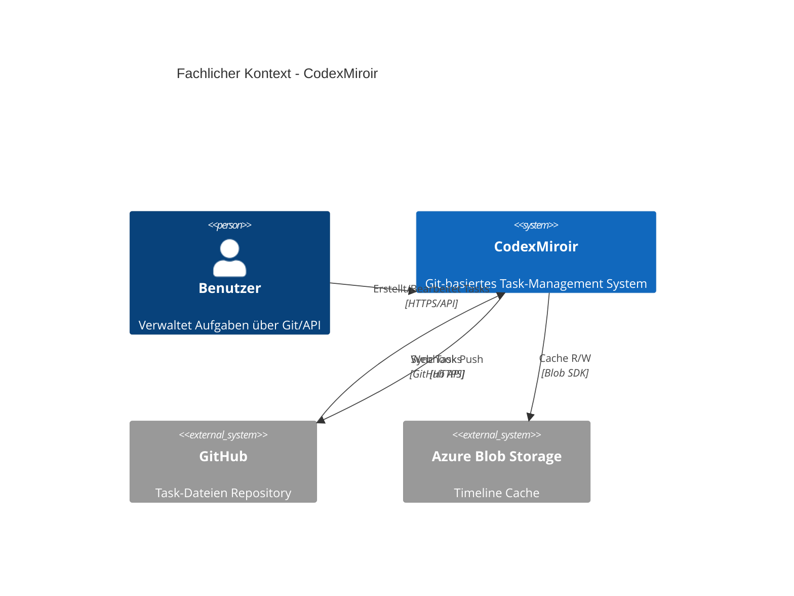
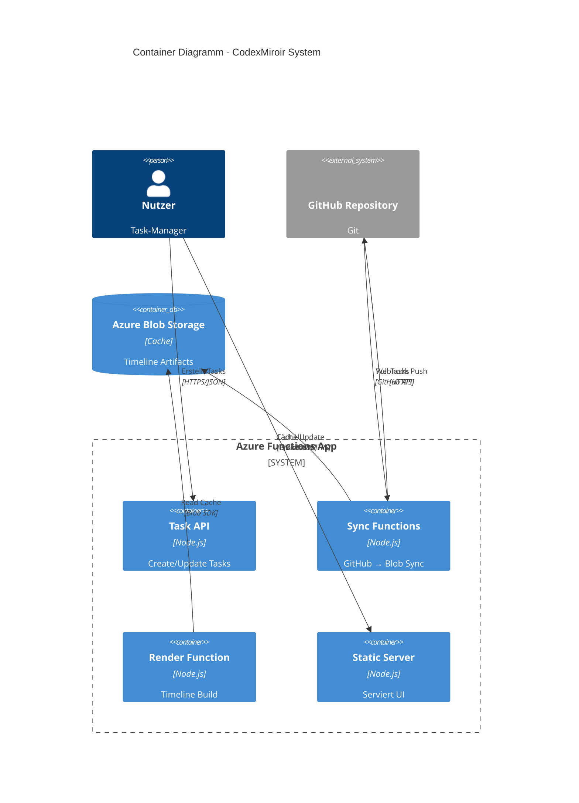
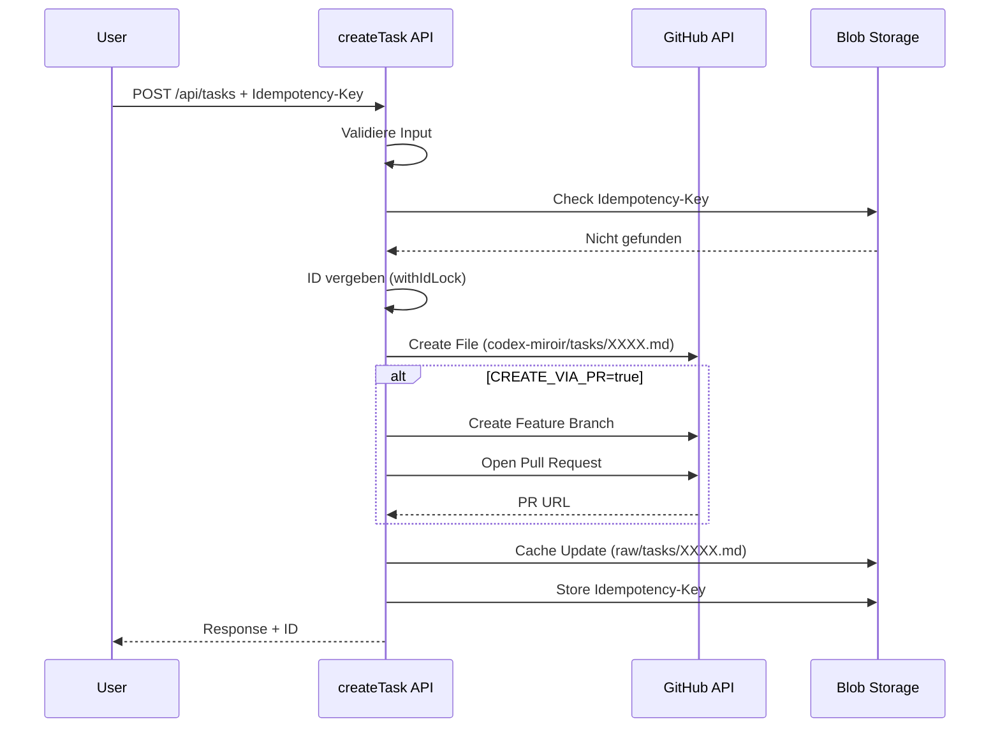
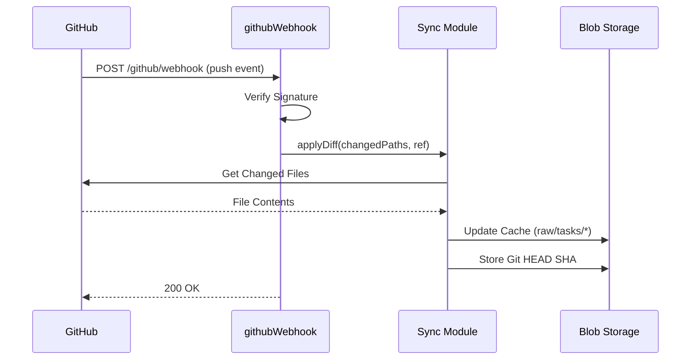

# CodexMiroir - Architektur Dokumentation

**Über arc42**

arc42, das Template zur Dokumentation von Software- und Systemarchitekturen.

Template Version 8.2 DE. (basiert auf AsciiDoc Version), Januar 2023

Created, maintained and © by Dr. Peter Hruschka, Dr. Gernot Starke and contributors. Siehe <https://arc42.org>.

# Einführung und Ziele

## Aufgabenstellung

CodexMiroir ist ein minimalistisches Task-Management-System nach dem **Spartarégime-Prinzip**.

### Kernprinzipien:
- **Git-basiert**: Tasks leben als Markdown-Dateien in GitHub Repository
- **Nummerierte Dateien**: 0000.md bis 9999.md im Ordner `codex-miroir/tasks/`
- **Dateiname = Reihenfolge**: Niedrigere Nummern werden zuerst eingeplant
- **Timeline-Rendering**: Automatische Wochenansicht aus gecachten Daten
- **Webhook-Sync**: GitHub → Azure Blob Storage Cache-Update
- **Keine Prio, kein Snooze**: Nur das Wesentliche

### Funktionale Anforderungen:
- Task-Verwaltung über Git (Markdown-Dateien in GitHub)
- Automatischer Sync von GitHub zu Azure Blob Storage
- Timeline-Rendering (JSON/HTML) mit Caching
- Deterministische Auto-Fill-Logik (Fixed first, dann nach Dateinamen)
- Kategorie-basierte Planung (arbeit = Mo-Fr, privat = Sa-So)
- GitHub Webhook-Integration für automatischen Sync
- ETag-basiertes HTTP Caching (basierend auf Git HEAD SHA)

## Qualitätsziele

| Priorität | Qualitätsziel | Szenario |
|-----------|---------------|----------|
| 1 | **Einfachheit** | Git-basierte Task-Verwaltung, minimales API-Setup |
| 2 | **Robustheit** | Validierung aller Inputs, Idempotenz-Support |
| 3 | **Performance** | Blob Storage Caching, schnelle Timeline-Berechnung |
| 4 | **Verfügbarkeit** | Azure Functions Skalierung, GitHub als Source of Truth |
| 5 | **Erweiterbarkeit** | PR-Support, modulare Architektur |

## Stakeholder

| Rolle | Kontakt | Erwartungshaltung |
|-------|---------|-------------------|
| **Einzelnutzer** | Endbenutzer | Einfache, fokussierte Task-Verwaltung ohne Ablenkung |
| **Entwickler** | merlinbecker | Wartbare, erweiterbare Codebase mit Clean Code Prinzipien |
| **Azure-Operator** | DevOps | Kostengünstige, skalierbare Azure Functions Deployment |

# Randbedingungen

## Technische Randbedingungen

- **Plattform**: Azure Functions v4 mit Node.js 18+ (ES Modules)
- **Datenspeicher**: Azure Blob Storage für Cache, GitHub als Source of Truth
- **Frontend**: Statische Web-UI (Vanilla JavaScript)
- **Sync**: GitHub API + Webhook für automatischen Pull
- **Authentifizierung**: GitHub Webhook Secret, Azure Functions Function Keys

## Organisatorische Randbedingungen

- **Team**: Ein Entwickler (merlinbecker)
- **Budget**: Kostengünstige Azure-Services (Pay-as-you-use)
- **Zeitrahmen**: Iterative Entwicklung
- **Dokumentation**: Deutsche Sprache, arc42-Standard

## Konventionen

- **Datumsformat**: dd.mm.yyyy (z.B. "02.10.2025")
- **Zeitslots**: morgens, nachmittags, abends
- **Sprache**: Deutsche Feldnamen im YAML, englische Codebase
- **Code**: ES Modules, async/await Pattern

# Kontextabgrenzung

## Fachlicher Kontext



# Lösungsstrategie

## Strategische Entscheidungen

1. **GitHub als Source of Truth**: Alle Tasks als Markdown-Dateien
   - *Begründung*: Git-Historie, einfache Versionierung, Backup inklusive

2. **Azure Blob Storage für Cache**: Schneller Zugriff auf Timeline-Daten
   - *Begründung*: Kosteneffizient, einfache API, hohe Performance

3. **Webhook-basierter Sync**: GitHub Push → Azure Function → Cache-Update
   - *Begründung*: Echtzeit-Updates, keine Polling-Kosten

4. **Idempotenz-Support**: Deduplizierung via Idempotency-Key
   - *Begründung*: Verhindert doppelte Tasks bei Retry-Logic

5. **PR-Support (optional)**: Tasks via Pull Requests erstellen
   - *Begründung*: Review-Workflow, Safe-Deployment möglich

# Bausteinsicht

## Whitebox Gesamtsystem



## API Functions

### createTask.js
- **Route**: POST `/api/tasks`
- **Funktion**: Erstellt neuen Task in GitHub
- **Features**: Validierung, Idempotenz, PR-Support

### updateTask.js
- **Route**: PUT/PATCH `/api/tasks/{id}`
- **Funktion**: Aktualisiert Task in GitHub
- **Features**: Partielle Updates, Validierung, PR-Support

### githubWebhook.js
- **Route**: POST `/github/webhook`
- **Funktion**: GitHub Webhook Handler
- **Features**: Signature-Validierung, Diff-basierter Sync

### manualSync.js
- **Route**: GET/POST `/sync`
- **Funktion**: Manueller Sync Trigger
- **Features**: Full-Sync, Clean-Option

### renderCodex.js
- **Route**: GET `/codex`
- **Funktion**: Timeline Rendering
- **Features**: JSON/HTML Output, ETag-Caching

### serveStatic.js
- **Route**: GET `/{*path}`
- **Funktion**: Statische UI
- **Features**: Public Access, File Serving

# Laufzeitsicht

## Task Creation Flow



## GitHub Webhook Flow



# Betrieb und Deployment

## Lokale Entwicklung einrichten

### 1. Repository klonen
```bash
git clone https://github.com/merlinbecker/CodexMiroir.git
cd CodexMiroir
npm install
```

### 2. Environment Variables konfigurieren

Die Datei `local.settings.json` ist bereits vorhanden:

```json
{
  "IsEncrypted": false,
  "Values": {
    "AzureWebJobsStorage": "UseDevelopmentStorage=true",
    "FUNCTIONS_WORKER_RUNTIME": "node",
    "GITHUB_OWNER": "merlinbecker",
    "GITHUB_REPO": "thoughts-vault",
    "GITHUB_BRANCH": "master",
    "GITHUB_BASE_PATH": "codexMiroir",
    "GITHUB_TOKEN": "<YOUR_GITHUB_TOKEN>",
    "AZURE_BLOB_CONN": "<YOUR_BLOB_CONNECTION_STRING>",
    "AZURE_BLOB_CONTAINER": "codex-cache",
    "CREATE_VIA_PR": "false",
    "GITHUB_PR_BRANCH_PREFIX": "codex/tasks"
  }
}
```

**Wichtige Einstellungen:**

| Variable | Beschreibung | Beispiel |
|----------|--------------|----------|
| `GITHUB_TOKEN` | GitHub Personal Access Token | `ghp_...` |
| `GITHUB_OWNER` | GitHub Username/Org | `merlinbecker` |
| `GITHUB_REPO` | Repository Name | `thoughts-vault` |
| `GITHUB_BASE_PATH` | Pfad im Repo | `codexMiroir` |
| `AZURE_BLOB_CONN` | Blob Storage Connection String | `DefaultEndpointsProtocol=...` |
| `CREATE_VIA_PR` | PR-Modus aktivieren | `true` / `false` |

### 3. Azure Blob Storage einrichten

#### Option A: Azurite Emulator (lokal)
```bash
npm install -g azurite
azurite --silent --location ./azurite --debug ./azurite/debug.log
```

#### Option B: Azure Blob Storage (Cloud)
1. Erstelle Storage Account in Azure Portal
2. Kopiere Connection String aus "Access keys"
3. Setze `AZURE_BLOB_CONN` in `local.settings.json`

### 4. GitHub Token erstellen

1. GitHub → Settings → Developer settings → Personal access tokens → Generate new token
2. Scopes: `repo` (Full control of private repositories)
3. Kopiere Token in `GITHUB_TOKEN`

### 5. Function App starten

```bash
npm start
```

Browser öffnen: `http://localhost:5000/`

## Azure Deployment

### 1. Azure Resources erstellen

```bash
# Resource Group
az group create --name codexmiroir-rg --location westeurope

# Storage Account
az storage account create \
  --name codexmiroirstorage \
  --resource-group codexmiroir-rg \
  --location westeurope \
  --sku Standard_LRS

# Function App
az functionapp create \
  --name codexmiroir-func \
  --resource-group codexmiroir-rg \
  --consumption-plan-location westeurope \
  --runtime node \
  --runtime-version 18 \
  --functions-version 4 \
  --storage-account codexmiroirstorage
```

### 2. Environment Variables konfigurieren

```bash
az functionapp config appsettings set \
  --name codexmiroir-func \
  --resource-group codexmiroir-rg \
  --settings \
    "GITHUB_TOKEN=<your-token>" \
    "GITHUB_OWNER=merlinbecker" \
    "GITHUB_REPO=thoughts-vault" \
    "GITHUB_BRANCH=master" \
    "GITHUB_BASE_PATH=codexMiroir" \
    "AZURE_BLOB_CONN=<connection-string>" \
    "AZURE_BLOB_CONTAINER=codex-cache" \
    "CREATE_VIA_PR=false"
```

### 3. Function App deployen

```bash
func azure functionapp publish codexmiroir-func
```

### 4. GitHub Webhook einrichten

1. GitHub Repository → Settings → Webhooks → Add webhook
2. **Payload URL**: `https://codexmiroir-func.azurewebsites.net/github/webhook`
3. **Content type**: `application/json`
4. **Secret**: Generiere starkes Secret, setze als `GITHUB_WEBHOOK_SECRET`
5. **Events**: `push`

### 5. Initial Sync ausführen

```bash
curl -X POST https://codexmiroir-func.azurewebsites.net/sync?clean=true
```

## Troubleshooting

### Lokale Entwicklung

**Problem**: "GITHUB_TOKEN not configured"
- **Lösung**: Setze `GITHUB_TOKEN` in `local.settings.json`

**Problem**: "Blob container not found"
- **Lösung**: Starte Azurite Emulator oder erstelle Container in Azure

**Problem**: Timer Function Warnung
- **Lösung**: Normal ohne Storage Emulator, HTTP-Endpoints funktionieren trotzdem

### Azure Deployment

**Problem**: Webhook-Aufrufe schlagen fehl
- **Lösung**: Prüfe GitHub Webhook Secret, validiere Signature-Berechnung

**Problem**: Sync funktioniert nicht
- **Lösung**: Prüfe GitHub Token Permissions (benötigt `repo` Scope)

**Problem**: Cache-Updates fehlen
- **Lösung**: Prüfe Blob Storage Connection String, Container-Name

# Risiken und technische Schulden

## Identifizierte Risiken

### Hohe Risiken

**R1: GitHub Token Sicherheit** 🔴
- **Beschreibung**: GitHub Token hat vollen Repo-Zugriff
- **Auswirkung**: Kompromittierung ermöglicht Code-Änderungen
- **Mitigation**: Token nur mit minimal nötigen Scopes, regelmäßige Rotation

**R2: ID-Kollisionen bei Concurrent Requests** ⚠️
- **Beschreibung**: `withIdLock()` nutzt Blob Storage Lock
- **Auswirkung**: Bei Blob Storage Ausfall können Kollisionen auftreten
- **Mitigation**: Idempotenz-Keys verwenden, Race-Condition-Tests

### Mittlere Risiken

**R3: GitHub API Rate Limits**
- **Beschreibung**: GitHub API hat Rate Limits (5000 req/h authenticated)
- **Auswirkung**: Bei vielen Tasks kann Sync geblockt werden
- **Mitigation**: Diff-basierter Sync, Caching, Exponential Backoff

**R4: Blob Storage Kosten bei Skalierung**
- **Beschreibung**: Viele Cache-Updates können teuer werden
- **Auswirkung**: Unerwartete Kosten
- **Mitigation**: Storage Analytics monitoring, Archive-Tier für alte Tasks

## Technische Schulden

**TD1: Fehlende End-to-End Tests** ⚠️
- **Problem**: Keine automatisierten Tests für GitHub-Integration
- **Auswirkung**: Regressions schwer zu erkennen
- **Priorität**: Mittel

**TD2: Keine Retry-Logic für GitHub API** 🔶
- **Problem**: Bei GitHub API Fehlern wird nicht automatisch wiederholt
- **Auswirkung**: Sync kann fehlschlagen
- **Priorität**: Mittel

**TD3: Webhook Secret Rotation nicht automatisiert** ⚠️
- **Problem**: Secret muss manuell in GitHub und Azure geändert werden
- **Priorität**: Niedrig

# Glossar

| Begriff | Definition |
|---------|------------|
| **Task** | Markdown-Datei in GitHub (XXXX.md) |
| **Timeline** | Wochenansicht mit Slots |
| **Zeitslot** | morgens, nachmittags, abends |
| **Fixed Slot** | Vordefinierter Slot (datum + zeit) |
| **Auto-Fill** | Automatische Slot-Zuweisung |
| **Idempotenz-Key** | Header zur Deduplizierung |
| **PR-Modus** | Tasks via Pull Requests erstellen |
| **Blob Cache** | Azure Blob Storage für Timeline-Artifacts |
| **Webhook Sync** | GitHub → Azure Function Push |
| **Diff Sync** | Nur geänderte Dateien syncen |
