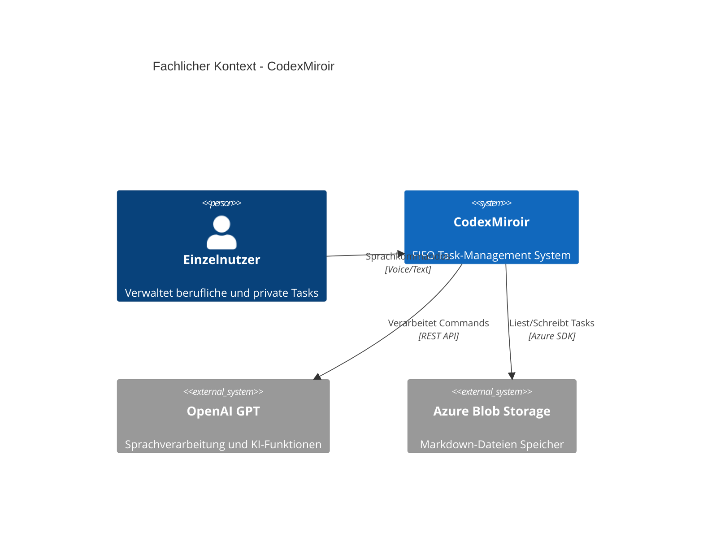
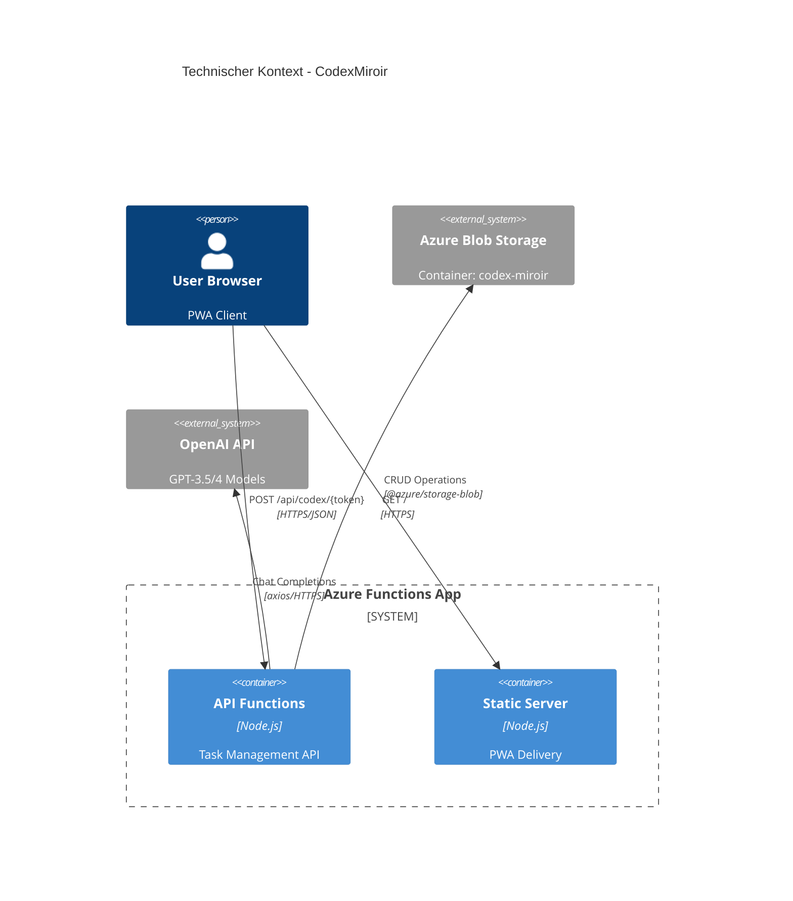
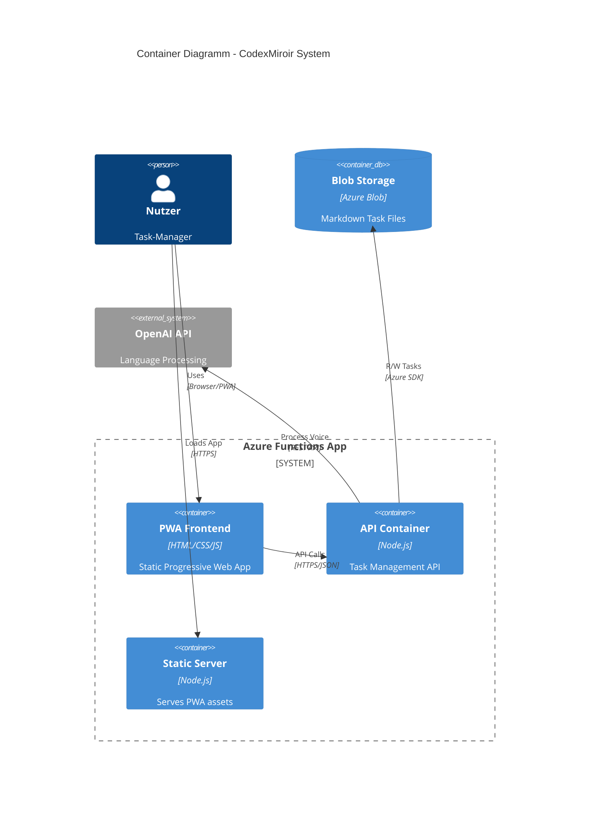
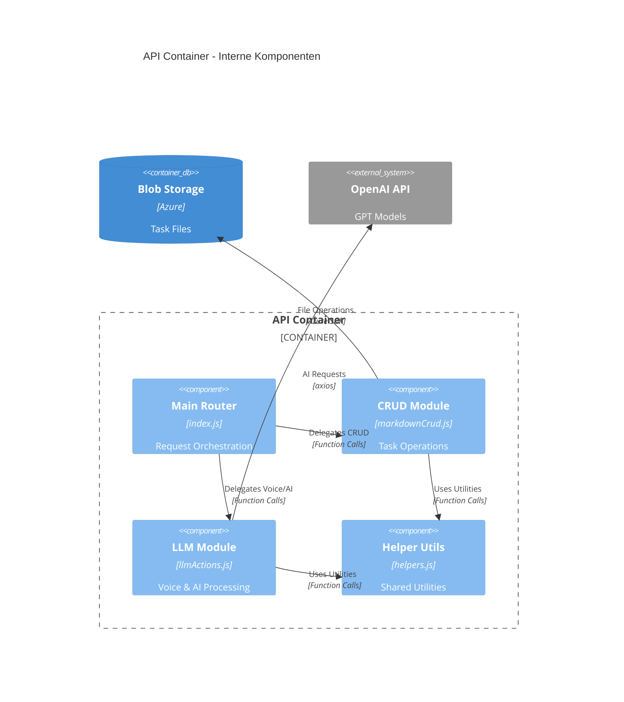
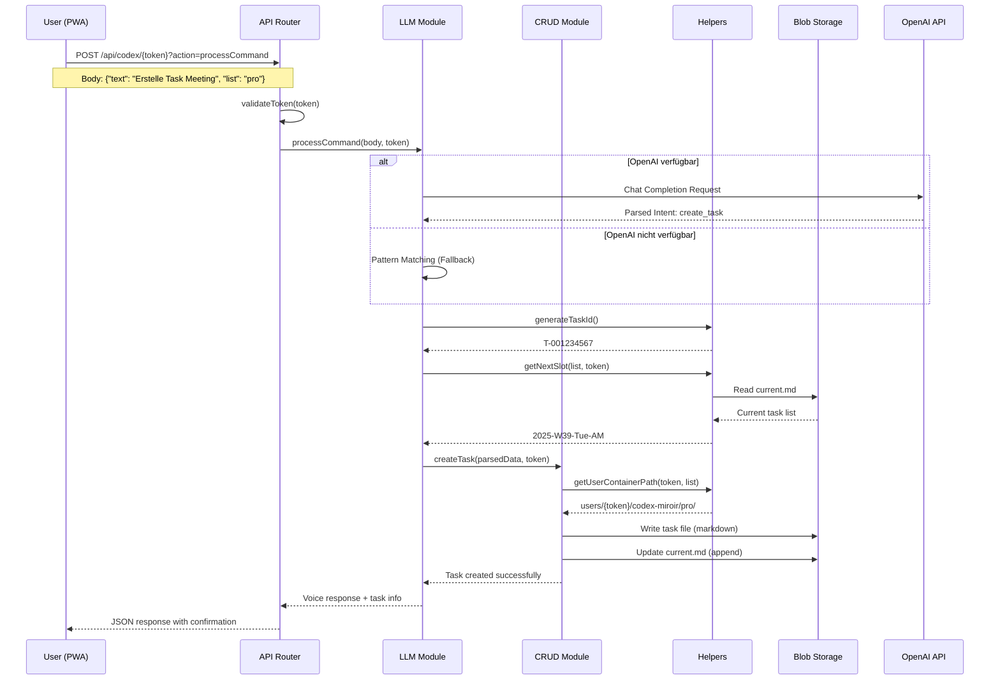
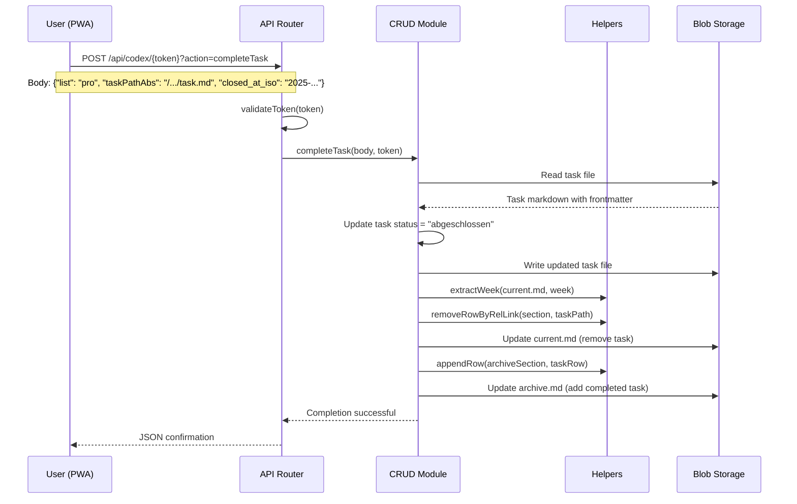

# CodexMiroir - Architektur Dokumentation

**Über arc42**

arc42, das Template zur Dokumentation von Software- und
Systemarchitekturen.

Template Version 8.2 DE. (basiert auf AsciiDoc Version), Januar 2023

Created, maintained and © by Dr. Peter Hruschka, Dr. Gernot Starke and
contributors. Siehe <https://arc42.org>.

# Einführung und Ziele

## Aufgabenstellung

CodexMiroir ist ein minimalistisches Task-Management-System, das nach dem **"Spiegelkodex"**-Prinzip funktioniert. Das System implementiert eine strikte **FIFO-Aufgabenverwaltung** mit dem Ziel, mentale Last zu reduzieren und Fokus zu erzwingen.

### Kernprinzipien:
- **Kein klassisches To-Do-Board**: Zeigt immer nur den aktuellen Task prominent an
- **Zwei getrennte Backlogs**: Beruflich (pro) und privat (priv) mit eigenen Zeitslots
- **3,5-Stunden-Chunks**: Jede Aufgabe entspricht einem Zeitslot
- **Sprachsteuerung**: KI-basierte Verarbeitung deutscher Kommandos
- **Markdown-basiert**: Menschlich lesbare und versionskontrollierbare Datenhaltung

### Funktionale Anforderungen:
- Task-Management (Erstellen, Abschließen, Verschieben)
- Sprachbasierte Kommandoverarbeitung mit OpenAI GPT
- Automatische Task-Zerlegung für große Aufgaben
- Kategoriebasierte Statistiken (Meeting vs. Programmierung, Haushalt vs. Projekt)
- Offline-fähige PWA mit Service Worker
- Token-basierte Benutzertrennung

## Qualitätsziele

| Priorität | Qualitätsziel | Szenario |
|-----------|---------------|----------|
| 1 | **Einfachheit** | Minimale UI mit nur einem sichtbaren Task, keine Drag&Drop-Funktionen |
| 2 | **Performance** | API-Response-Zeiten < 200ms für CRUD-Operationen |
| 3 | **Verfügbarkeit** | Offline-Funktionalität durch PWA und Service Worker |
| 4 | **Erweiterbarkeit** | Modulare Architektur für einfache Feature-Erweiterungen |
| 5 | **Benutzerfreundlichkeit** | Deutsche Sprachkommandos für natürliche Interaktion |
| 6 | **Datenschutz** | Token-basierte Benutzertrennung ohne zentrale Benutzerverwaltung |

## Stakeholder

| Rolle | Kontakt | Erwartungshaltung |
|-------|---------|-------------------|
| **Einzelnutzer** | Endbenutzer | Einfache, fokussierte Task-Verwaltung ohne Ablenkung |
| **Entwickler** | merlinbecker | Wartbare, erweiterbare Codebase mit Clean Code Prinzipien |
| **Azure-Operator** | DevOps | Kostengünstige, skalierbare Azure Functions Deployment |

# Randbedingungen

## Technische Randbedingungen

- **Plattform**: Azure Functions v4 mit Node.js 18+
- **Datenspeicher**: Azure Blob Storage (Markdown-Dateien)
- **KI-Integration**: OpenAI GPT für Sprachverarbeitung
- **Frontend**: Progressive Web App (PWA) mit Service Worker
- **Authentifizierung**: Token-basiert (keine zentrale Benutzerverwaltung)

## Organisatorische Randbedingungen

- **Team**: Ein Entwickler (merlinbecker)
- **Budget**: Kostengünstige Azure-Services (Pay-as-you-use)
- **Zeitrahmen**: Iterative Entwicklung in 3 Phasen
- **Dokumentation**: Deutsche Sprache, arc42-Standard

## Konventionen

- **Datumsformat**: Europäisch (dd.mm.yyyy HH:MM)
- **Zeitslots**: ISO-ähnlich (YYYY-Www-DOW-AM/PM)
- **Sprache**: Deutsche Benutzeroberfläche und Sprachkommandos
- **Code**: Englische Kommentare, deutsche Fehlermeldungen

# Kontextabgrenzung

## Fachlicher Kontext



**Externe fachliche Schnittstellen:**

- **Nutzer → CodexMiroir**: Task-Management über Web-Interface oder Sprachkommandos
- **CodexMiroir → OpenAI**: Verarbeitung natürlichsprachiger Kommandos
- **CodexMiroir → Azure Storage**: Persistierung von Tasks als Markdown-Dateien

## Technischer Kontext



**Technische Schnittstellen:**

| Schnittstelle | Protokoll | Format | Beschreibung |
|---------------|-----------|---------|--------------|
| **PWA → API** | HTTPS | JSON | Task-Management-Operationen |
| **API → Blob Storage** | Azure SDK | Markdown | Dateipersistierung |
| **API → OpenAI** | HTTPS | JSON | Sprachverarbeitung |

# Lösungsstrategie

Die Architektur folgt dem **Single-Function-Prinzip** mit modularer interner Struktur:

## Strategische Entscheidungen

1. **Azure Functions Only**: Komplette Migration von Express/React zu Azure Functions
   - *Begründung*: Kosteneffizienz, einfache Deployment, serverless Skalierung

2. **Markdown als Datenformat**: Strukturierte Dateien statt Datenbank
   - *Begründung*: Menschlich lesbar, versionskontrollierbar, einfach zu migrieren

3. **Token-basierte Benutzertrennung**: Kein klassisches User-Management
   - *Begründung*: Datenschutz, einfache Implementierung, keine Registrierung nötig

4. **Progressive Web App**: Static PWA statt React/Next.js
   - *Begründung*: Offline-Fähigkeit, Performance, einfachere Wartung

5. **KI-Integration**: OpenAI für deutsche Sprachkommandos
   - *Begründung*: Natürliche Bedienung, automatische Task-Zerlegung

## Technologie-Stack

- **Runtime**: Node.js 18+ auf Azure Functions v4
- **Storage**: Azure Blob Storage mit Markdown-Dateien
- **AI**: OpenAI GPT-3.5/4 für Sprachverarbeitung
- **Frontend**: Vanilla JS PWA mit AlpineJS
- **Testing**: Jest mit Coverage-Reports

# Bausteinsicht

## Whitebox Gesamtsystem



**Begründung:**
Die Architektur trennt klar zwischen statischer PWA-Auslieferung und API-Funktionalität. Dies ermöglicht Offline-Fähigkeit der UI bei gleichzeitig dynamischer Server-Side-Verarbeitung.

**Enthaltene Bausteine:**

### API Container (Codex)
- **Zweck**: Zentrale Geschäftslogik für Task-Management
- **Verantwortung**: CRUD-Operationen, Sprachverarbeitung, Token-Authentifizierung
- **Technologie**: Node.js mit modularer Struktur

### PWA Frontend
- **Zweck**: Benutzeroberfläche mit Offline-Support  
- **Verantwortung**: Task-Anzeige, Voice-Interface, lokale Synchronisation
- **Technologie**: Vanilla JS, Service Worker, AlpineJS

### Static Server
- **Zweck**: Auslieferung der PWA-Assets
- **Verantwortung**: SPA-Routing, Cache-Headers, Asset-Serving
- **Technologie**: Node.js Azure Function

## Ebene 2

### Whitebox API Container (Codex)



**Komponenten-Beschreibung:**

### Main Router (index.js)
- **Zweck**: HTTP-Request-Routing und Orchestrierung
- **Schnittstellen**: HTTP Trigger, Token-Validation, Error Handling
- **Leistungsmerkmale**: <200ms Response Time, Comprehensive Logging
- **Ablageort**: `/codex/index.js`

### CRUD Module (markdownCrud.js)  
- **Zweck**: Task-Management-Operationen auf Markdown-Dateien
- **Schnittstellen**: createTask, completeTask, pushToEnd, report, when
- **Qualitätsmerkmale**: ACID-Properties durch Azure Blob Storage
- **Ablageort**: `/codex/markdownCrud.js`

### LLM Module (llmActions.js)
- **Zweck**: KI-basierte Sprachverarbeitung und Task-Analyse  
- **Schnittstellen**: processCommand, decomposeTask, getCurrentTask
- **Qualitätsmerkmale**: Fallback auf Pattern-Matching bei OpenAI-Ausfall
- **Ablageort**: `/codex/llmActions.js`

### Helper Utils (helpers.js)
- **Zweck**: Gemeinsame Utility-Funktionen für das System
- **Schnittstellen**: Token-Validation, Date-Utils, Storage-Helpers
- **Qualitätsmerkmale**: Stateless, Pure Functions
- **Ablageort**: `/codex/helpers.js`

# Laufzeitsicht

## Task Creation Scenario



## Task Completion Scenario



# Verteilungssicht

## Infrastruktur Ebene 1

```mermaid
C4Deployment
    title Deployment Diagramm - Azure Infrastructure
    
    Deployment_Node(azure_region, "Azure West Europe") {
        Deployment_Node(rg, "Resource Group") {
            Deployment_Node(func_app, "Function App", "Azure Functions v4") {
                Container(codex_fn, "codex", "Node.js Function", "API Endpoints")  
                Container(static_fn, "static", "Node.js Function", "PWA Serving")
            }
            Deployment_Node(storage_acc, "Storage Account", "Azure Blob Storage") {
                ContainerDb(blob_container, "codex-miroir", "Container", "Markdown Files")
            }
        }
    }
    
    Deployment_Node(user_device, "User Device") {
        Container(browser, "Browser", "PWA Runtime", "Cached App")
    }
    
    System_Ext(openai_cloud, "OpenAI Cloud", "GPT API")
    
    Rel(browser, func_app, "HTTPS Requests", "Internet")
    Rel(func_app, storage_acc, "Azure SDK", "Internal Network")
    Rel(func_app, openai_cloud, "REST API", "Internet")
```

**Begründung:**
Single Azure Functions App hostet sowohl API als auch Frontend. Dies reduziert Komplexität, Kosten und Konfigurationsaufwand.

**Qualitäts- und Leistungsmerkmale:**
- **Verfügbarkeit**: 99.9% SLA durch Azure Functions
- **Skalierbarkeit**: Automatische Skalierung basierend auf Request-Load
- **Latenz**: <200ms durch europäischen Azure-Standort
- **Kosten**: Pay-per-execution Model für niedrige Betriebskosten

**Zuordnung von Bausteinen zu Infrastruktur:**

| Baustein | Azure Service | Begründung |
|----------|---------------|------------|
| API Container | Azure Functions (Node.js) | Serverless, automatische Skalierung |
| PWA Frontend | Azure Functions (Static) | Einfache Auslieferung, SPA-Routing |
| Task Storage | Azure Blob Storage | Kostengünstig, hohe Verfügbarkeit |
| Voice Processing | OpenAI API | Externe KI-Expertise |

# Querschnittliche Konzepte

## Authentication & Authorization

**Token-basierte Benutzertrennung:**
- Jeder Nutzer erhält einen 8+ Zeichen Token
- Token wird im URL-Pfad übertragen: `/api/codex/{token}`
- Automatische Datenkapselung: `users/{token}/codex-miroir/`
- Keine zentrale Benutzerverwaltung erforderlich

## Datenformat & Persistierung

**Markdown-basierte Task-Speicherung:**
```yaml
# Task-Datei Struktur
---
id: T-001234567
list: pro|priv  
title: "Task Beschreibung"
status: geplant|aktiv|abgeschlossen
created_at: dd.mm.yyyy HH:MM
scheduled_slot: YYYY-Www-DOW-AM/PM
duration_slots: 1
deadline: dd.mm.yyyy HH:MM  
project: "Projektname"
category_pro: meeting|programmierung
category_priv: haushalt|projekt
---

## Notiz
Detaillierte Task-Beschreibung

## Verlauf  
- dd.mm.yyyy HH:MM → Status-Änderung
```

## Internationalisierung

**Deutsche Lokalisierung:**
- Datumsformat: Europäisch (dd.mm.yyyy)
- Sprachkommandos: Deutsche Sprache
- Fehlermeldungen: Deutsch
- Wochentage: Deutsch in Zeitslots

## Error Handling & Logging

**Mehrstufige Fehlerbehandlung:**
1. **Input Validation**: Auf API-Ebene
2. **Business Logic Errors**: Mit detaillierten Meldungen
3. **System Errors**: Mit Fallback-Mechanismen
4. **User-friendly Messages**: Deutsche Fehlermeldungen

**Logging-Konzept:**
- Azure Functions integrierte Logs
- Performance-Metriken (Response-Zeit)
- Fehler-Tracking mit Stack-Traces
- Request/Response Logging für Debugging

## Offline-Fähigkeit

**Progressive Web App Pattern:**
- Service Worker für Asset-Caching
- Local Storage für Token-Speicherung
- Background Sync für pending API calls
- Fallback UI bei Netzwerkfehlern

# Architekturentscheidungen

## ADR-001: Azure Functions statt Express/React

**Status**: Entschieden (September 2025)

**Kontext**: Ursprünglich Express/React/PostgreSQL Stack, hohe Hosting-Kosten und Komplexität

**Entscheidung**: Migration zu Azure Functions-only Architektur

**Begründung**:
- ✅ Kosteneinsparung durch Serverless Pay-per-use
- ✅ Einfacheres Deployment (Single Function App)
- ✅ Automatische Skalierung
- ✅ Integrierte Monitoring-Tools
- ❌ Vendor Lock-in zu Microsoft Azure

## ADR-002: Token-basierte Authentifizierung

**Status**: Entschieden (September 2025)

**Kontext**: Bedarf für Benutzertrennung ohne komplexe User-Management-Systeme

**Entscheidung**: Secure Tokens im URL-Pfad statt API-Key Headers

**Begründung**:
- ✅ Einfache Implementierung ohne Datenbank
- ✅ Datenschutz durch lokale Token-Speicherung
- ✅ Keine Registrierung erforderlich
- ✅ Automatische Datenkapselung
- ❌ Token-Verlust führt zu Datenverlust

## ADR-003: Markdown-Dateien statt Datenbank

**Status**: Entschieden (Phase 1)

**Kontext**: Einfache, wartbare Datenhaltung für Task-Management

**Entscheidung**: Azure Blob Storage mit Markdown-Dateien

**Begründung**:
- ✅ Menschlich lesbar und editierbar
- ✅ Versionskontrolle möglich
- ✅ Einfache Backup/Migration
- ✅ Kostengünstig
- ❌ Begrenzte Query-Möglichkeiten
- ❌ Keine ACID-Transaktionen

## ADR-004: OpenAI Integration für Sprachverarbeitung

**Status**: Entschieden (Phase 2)

**Kontext**: Deutsche Sprachkommandos für natürliche Bedienung

**Entscheidung**: OpenAI GPT für NLP mit Pattern-Matching Fallback

**Begründung**:
- ✅ Hohe Qualität bei deutscher Sprache
- ✅ Flexible Intent-Erkennung
- ✅ Fallback bei API-Ausfall
- ❌ Externe Abhängigkeit
- ❌ Kosten pro API-Call

# Qualitätsanforderungen

## Qualitätsbaum

```
CodexMiroir Qualität
├── Funktionalität
│   ├── Task-Management (Hoch)
│   │   ├── CRUD-Operationen
│   │   └── Sprachsteuerung
│   └── Offline-Fähigkeit (Mittel)
├── Zuverlässigkeit  
│   ├── Fehlertoleranz (Hoch)
│   │   ├── Graceful Degradation
│   │   └── Fallback-Mechanismen
│   └── Wiederherstellbarkeit (Mittel)
├── Benutzbarkeit
│   ├── Einfachheit (Sehr Hoch)
│   │   ├── Ein-Task-Fokus
│   │   └── Minimale UI
│   └── Deutscher Sprachsupport (Hoch)
├── Effizienz
│   ├── Antwortzeit (Hoch)
│   │   └── <200ms API Calls
│   └── Speicherverbrauch (Mittel)
└── Wartbarkeit
    ├── Modulare Architektur (Hoch)
    ├── Clean Code (Hoch)
    └── Testabdeckung (Mittel)
```

## Qualitätsszenarien

### Szenario 1: Performance (Hoch)
**Stimulus**: Nutzer erstellt neuen Task über Sprachkommando  
**Response**: System verarbeitet Kommando und erstellt Task  
**Measure**: Response-Zeit <200ms in 95% der Fälle

### Szenario 2: Verfügbarkeit (Hoch)
**Stimulus**: OpenAI API ist nicht erreichbar  
**Response**: System fällt auf lokales Pattern-Matching zurück  
**Measure**: Funktionalität bleibt zu 80% erhalten

### Szenario 3: Benutzbarkeit (Sehr Hoch)
**Stimulus**: Nutzer öffnet App  
**Response**: Aktueller Task wird prominent angezeigt  
**Measure**: Nur ein Task sichtbar, keine Ablenkungen

### Szenario 4: Wartbarkeit (Hoch)
**Stimulus**: Entwickler will neue Funktion hinzufügen  
**Response**: Modulare Struktur ermöglicht einfache Erweiterung  
**Measure**: Neue Features in <4 Stunden implementierbar

### Szenario 5: Offline-Nutzung (Mittel)
**Stimulus**: Nutzer verliert Internetverbindung  
**Response**: PWA funktioniert mit gecachten Daten weiter  
**Measure**: Grundfunktionen bleiben verfügbar

# Risiken und technische Schulden

## Identifizierte Risiken

### Hohe Risiken

**R1: OpenAI API Integration nicht implementiert** 🔴
- **Beschreibung**: Sprachverarbeitung per OpenAI API ist in arc42 dokumentiert, aber nicht im aktuellen Code vorhanden
- **Auswirkung**: Fehlende Voice-Kommando-Funktionalität trotz Dokumentation
- **Mitigation**: Keine - Feature muss implementiert oder aus Dokumentation entfernt werden
- **Status**: 🔴 KRITISCH - Diskrepanz zwischen Dokumentation und Implementierung

**R2: User-Verlust führt zu Datenverlust**  
- **Beschreibung**: Nutzer-IDs sind nicht wiederherstellbar (URL-Parameter basiert)
- **Auswirkung**: Komplettverlust aller Tasks bei Verlust der User-ID
- **Mitigation**: Benutzer-Aufklärung über User-ID-Backup
- **Status**: ⚠️ Aktuell nur durch User-Education mitigiert

### Mittlere Risiken

**R3: Azure Vendor Lock-in**
- **Beschreibung**: Komplette Abhängigkeit von Azure Functions und Azure Cosmos DB
- **Auswirkung**: Migration zu anderen Cloud-Anbietern schwierig
- **Mitigation**: Cosmos DB JSON-Format ermöglicht einfache Daten-Migration
- **Status**: 🔶 Akzeptiertes Risiko für Kosteneinsparungen

**R4: Skalierungsgrenze bei großen Task-Mengen**
- **Beschreibung**: Cosmos DB Queries bei 1000+ Tasks ohne Indexoptimierung könnte langsam werden
- **Auswirkung**: Performance-Degradation bei Power-Usern
- **Mitigation**: Geplante Implementierung von Query-Optimierung und Indizes
- **Status**: 🔶 Monitoring erforderlich

**R5: Fehlende PWA-Funktionalität** 🔴
- **Beschreibung**: Service Worker und Offline-Funktionalität dokumentiert aber nicht implementiert
- **Auswirkung**: Keine Offline-Fähigkeit, trotz Dokumentation als PWA
- **Mitigation**: Keine - Feature muss implementiert oder aus Dokumentation entfernt werden
- **Status**: 🔴 KRITISCH - Diskrepanz zwischen Dokumentation und Implementierung

## Technische Schulden

### Code-Qualität

**TD1: Architektur-Dokumentation veraltet** 🔴
- **Problem**: arc42 beschreibt alte Architektur (Markdown/Blob Storage, /codex/-Module)
- **Ist-Zustand**: Cosmos DB mit /src/-Modulen implementiert
- **Auswirkung**: Neue Entwickler werden durch veraltete Dokumentation fehlgeleitet
- **Priorität**: HOCH
- **Status**: 🔴 Dokumentation muss aktualisiert werden

**TD2: Fehlende Eingabevalidierung** ⚠️
- **Problem**: Grundlegende Validation vorhanden, aber nicht vollständig
- **Auswirkung**: Mögliche Runtime-Errors bei malformed Requests
- **Priorität**: Mittel
- **Status**: ⚠️ Teilweise implementiert, Erweiterung geplant

### Architektur

**TD3: LLM/Voice-Modul nicht implementiert** 🔴
- **Problem**: llmActions.js existiert nicht, OpenAI-Integration fehlt komplett
- **Dokumentiert**: Voice Commands, Pattern-Matching Fallback, Task-Zerlegung
- **Auswirkung**: Kernfunktionalität aus Dokumentation nicht verfügbar
- **Priorität**: HOCH (wenn Feature gewünscht) oder Dokumentation bereinigen
- **Status**: 🔴 Feature fehlt oder Dokumentation entfernen

**TD4: Stored Procedures nicht deployed** ⚠️
- **Problem**: Stored Procedures in /database/ vorhanden aber Deployment-Status unklar
- **Auswirkung**: AutoFill und Slot-Assignment Logik möglicherweise nicht funktional
- **Priorität**: Hoch
- **Status**: ⚠️ Deployment-Status muss verifiziert werden

### Testing & Monitoring

**TD5: Tests testen Mock-Implementierungen statt Source Code** 🔴
- **Problem**: Alle 99 Tests testen duplizierte Logik in __tests__/, nicht /src/
- **Coverage**: 0% für gesamten src/-Code trotz 99 passing tests
- **Auswirkung**: Keine echte Testabdeckung, Regressions werden nicht erkannt
- **Priorität**: KRITISCH
- **Status**: 🔴 Tests müssen refaktoriert werden um echten Code zu testen

**TD6: Fehlendes Application Monitoring** 🔶
- **Problem**: Keine Business-Metriken (Task-Erstellungsrate, etc.)
- **Auswirkung**: Keine Insights über Nutzerverhalten
- **Status**: 🔶 Azure Insights vorhanden, Custom Metrics fehlen

**TD7: codequality/ Directory noch vorhanden** ⚠️
- **Problem**: codequality/report.md existiert noch, aber als "Entfernt" dokumentiert
- **Auswirkung**: Inkonsistenz zwischen Dokumentation und Repository
- **Priorität**: Niedrig (Dokumentationsfehler)
- **Status**: ⚠️ Verzeichnis löschen oder Dokumentation korrigieren

## Veraltete/Redundante Komponenten

**Bereinigte Dateien (Oktober 2024):** ✅
- `client/` - React Frontend Quellen (durch PWA ersetzt) - Bereits entfernt
- `server/` - Express Server (durch Azure Functions ersetzt) - Bereits entfernt
- Diverse Config-Dateien für Next.js/React Stack - Bereits entfernt
- Migration-Scripts für PostgreSQL → Azure Blob - Bereits entfernt
- `results/` - Alte Frontend Refactoring Reports und Backups - Entfernt
- `attached_assets/` - Temporäre Issue-Diskussions-Inhalte - Entfernt
- `test-token-auth.js`, `integration-test.js` - Manuelle Test-Dateien (durch Jest __tests__/ ersetzt) - Entfernt
- `frontend/test.html` - Test-Datei - Entfernt
- Root `index.html` - Legacy-Build-Datei mit ungültigen Asset-Referenzen - Entfernt

**Noch vorhandene Dateien (sollten bereinigt werden):** ⚠️
- `codequality/` - Generierte Code Quality Reports - Dokumentiert als entfernt, aber noch vorhanden

**Inkonsistenzen in Dokumentation:**
- arc42 dokumentiert `/codex/` Module (index.js, markdownCrud.js, llmActions.js, helpers.js)
- Tatsächlich existiert `/src/` mit anderen Modulen (_cosmos.js, createTask.js, getTask.js, etc.)
- arc42 dokumentiert "Azure Blob Storage (Markdown-Dateien)" als Datenspeicher
- Tatsächlich wird Azure Cosmos DB verwendet
- arc42 dokumentiert PWA mit Service Worker als implementiert
- Tatsächlich fehlen sw.js und manifest.json komplett
- arc42 dokumentiert OpenAI Integration mit Fallback
- Tatsächlich ist keine OpenAI Integration im Code vorhanden

**Status**: 🔴 Code-Bereinigung teilweise, aber KRITISCHE Dokumentations-Inkonsistenzen

# Glossar

| Begriff | Definition |
|---------|------------|
| **Spiegelkodex** | Philosophie der strikten FIFO-Task-Verwaltung ohne Reorder-Möglichkeiten |
| **FIFO** | First In, First Out - Tasks werden strikt in der Reihenfolge abgearbeitet, wie sie erstellt wurden |
| **Zeitslot** | 3,5-Stunden-Block für Task-Bearbeitung (AM: 08:00-11:30, PM: 13:00-16:30) |
| **Token** | 8+ Zeichen String zur Benutzeridentifikation und Datentrennung |
| **PWA** | Progressive Web App - Web-Anwendung mit App-ähnlichen Eigenschaften |
| **Slot-ID** | Eindeutige Zeitslot-Kennzeichnung im Format YYYY-Www-DOW-AM/PM |
| **Task-Zerlegung** | Automatische Aufteilung großer Tasks in 3,5h-Chunks durch KI |
| **Frontmatter** | YAML-Metadaten am Anfang von Markdown-Dateien |
| **current.md** | Markdown-Datei mit aktuell geplanten Tasks einer Liste |
| **archive.md** | Markdown-Datei mit abgeschlossenen Tasks einer Liste |
| **Pattern-Matching** | Fallback-Mechanismus für Sprachverarbeitung ohne OpenAI |
| **Clean Code** | Programmierphilosophie für lesbaren, wartbaren Code |
| **Azure Functions v4** | Neueste Version des Azure Serverless-Frameworks |
| **Blob Container** | Azure Storage Container für Dateien (hier: Markdown Tasks) |
| **Service Worker** | Browser-Technologie für Offline-Fähigkeit und Caching |
| **C4 Model** | Context, Containers, Components, Code - Architektur-Diagramm-Standard |
| **arc42** | Standard-Template für Software-Architektur-Dokumentation |