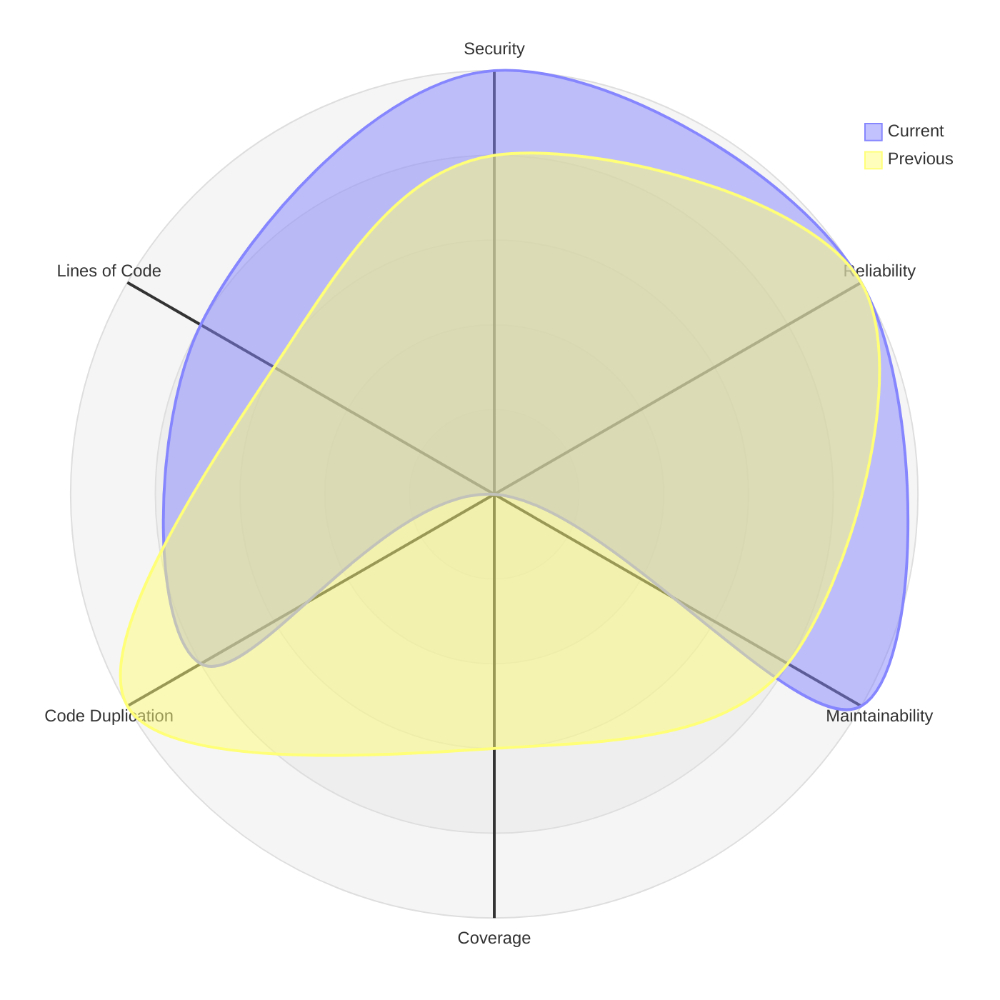

# Cloud Grimoire #1 – Die Beschwörung des Qualitäts-Radars

👁️ **Szene / Einstieg**  
Im Nebel der CI/CD-Pipeline wollte ich einen Spiegel erschaffen – einen, der nicht lügt, sondern die wahre Natur meines Codes offenbart. SonarCloud sollte sprechen, und seine Worte sollten sich in einem leuchtenden Radar-Chart manifestieren, das Vergangenheit und Gegenwart vergleicht.

⚡ **Der Bruch / das Problem**  
Die erste Beschwörung schlug fehl. SonarCloud sprach zwar, doch seine Stimme kam nicht durch. Die API-Authentifizierung verweigerte den Zugang – ein Token allein genügt nicht, es braucht das richtige Ritual: `curl -u "${SONAR_TOKEN}:"` mit dem mystischen Doppelpunkt am Ende.

Als die Verbindung stand, kam die nächste Verwirrung: SonarCloud spricht in Rätseln. Ein Rating von "1" bedeutet "A" (exzellent), ein Rating von "5" bedeutet "E" (mangelhaft). Doch für mein Radar-Chart wollte ich, dass 5 das Beste ist – die Sterne sollten nach oben zeigen, nicht nach unten fallen.

Dann die dritte Hürde: Beim ersten Lauf gab es keine "vorherigen Metriken". Die API gab leere Antworten zurück, und das Skript zerbrach. Ich musste lernen, mit der Leere umzugehen, graceful zu scheitern, einen zweiten Curve nur zu zeichnen, wenn es eine Geschichte zu erzählen gab.

🔍 **Die Entdeckung / Erkenntnis**  
Die Lösung lag in drei magischen Transformationen:

**Transformation 1: Die Inversion der Ratings**
```javascript
function transformRating(value) {
  if (!value || value === 'No data') return 0;
  const num = parseInt(value);
  return num ? 6 - num : 0; // Die Umkehrung: 1→5, 5→1
}
```

**Transformation 2: Das Schweigen der Leere**
```bash
if echo "$current_json" | grep -q '"component"'; then
  echo "✅ Successfully fetched current metrics"
else
  echo "⚠️ Using default values."
  current_json='{"component":{"measures":[]}}'
fi
```

**Transformation 3: Der bedingte Vergleich**
```javascript
const hasPrevious = previousData.measures?.length > 0;
const radarChart = [
  `  curve current["Current"]{${current.security}, ...}`,
  hasPrevious ? `  curve previous["Previous"]{${previous.security}, ...}` : '',
].filter(line => line !== '').join('\n');
```

Der entscheidende Durchbruch: SonarCloud hat **zwei API-Endpunkte** für unterschiedliche Zeitreisen:
- `/api/measures/component` – die Gegenwart
- `/api/measures/search_history` – die Vergangenheit

Beide mussten gebändigt werden, um das Radar zum Leben zu erwecken.

**Das Chart selbst – Mermaid als Beschwörungsformel:**


Sechs Achsen. Zwei Kurven. Eine Wahrheit.

**Die Badges – Siegel der Qualität:**
```markdown
[]
[]
```

Live-Badges, die sich mit jedem Scan aktualisieren. Klickbar. Verlinkt zur vollständigen Analyse.

**Das intelligente Überspringen – Nicht jedes Ritual ist nötig:**
```yaml
- name: Check if PR has chore label
  uses: actions/github-script@v7
  with:
    script: |
      const hasChoreLabel = labels.includes('chore');
      core.setOutput('should-run', !hasChoreLabel);
```

Chore-PRs (Dokumentation, kleine Fixes) verschwenden keine CI-Zeit mehr. Das Ritual springt über, spart Ressourcen, bleibt fokussiert.

✨ **Die neue Rune im Grimoire**  
_„Ein Rating ist ein Spiegel, doch nur im richtigen Licht zeigt er die Wahrheit. Invertiere die Skala, umarme die Leere, und das Radar wird leuchten. Zwei Kurven sprechen lauter als eine – die Vergangenheit ist der Schatten der Gegenwart."_

**Die Essenz:**
- SonarCloud-Ratings invertieren (6 - rating)
- Graceful handling für fehlende History
- Mermaid radar-beta mit conditional previous curve
- Badges für sofortige visuelle Übersicht
- Smart skipping für Chore-PRs

**Das Ergebnis:**
Ein automatischer Quality Report mit leuchtendem Radar-Chart, der bei jedem Push und PR erscheint. Sechs Dimensionen der Code-Qualität visualisiert. Vergleich zwischen aktuell und vorherig auf einen Blick. Live-Badges die zum Klicken einladen.

🌙 **Ausblick / offenes Ende**  
Das Radar dreht sich nun von selbst, bei jedem Commit, bei jedem PR. Doch eine Frage bleibt: Können wir die Trends über Wochen verfolgen? Ein langfristiges Qualitäts-Archiv, das zeigt, wie der Code über Monate gereift ist? Die nächste Beschwörung wartet bereits...

---

**Links & Referenzen:**
- [SonarCloud API Documentation](https://sonarcloud.io/web_api)
- [Mermaid Radar Charts](https://mermaid.js.org/syntax/radar.html)
- [GitHub Actions Conditionals](https://docs.github.com/en/actions/using-workflows/workflow-syntax-for-github-actions#jobsjob_idstepsif)

_Geschrieben im CodexMiroir, wo Code und Qualität sich spiegeln._
